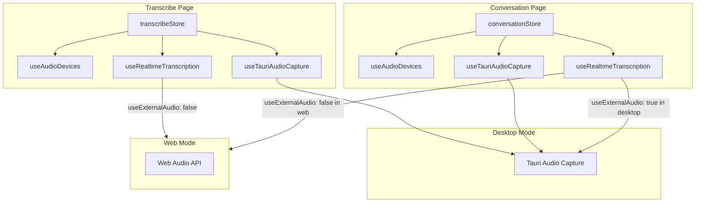

# Audio Device Mode Switching Fix Plan

## Status: COMPLETED ✅

## Problem Statement

When a user is recording in Transcribe mode, switches to Conversation mode, and then switches back, they become stuck in recording mode with audio devices not working. The UI shows "Recording..." but no audio capture is actually happening.

## Requirements (from user)

1. **Conversation mode**: Support microphone input device selection only (not system audio)
2. **Page navigation**: Unmounting or changing pages should unload audio devices and reset state
3. **Cross-platform**: Apply to both desktop and web versions

## Root Cause Analysis

### Issue 1: Stale Recording State on Page Navigation

The `transcribeStore` maintains `isRecording: true` across page navigations, but the actual audio capture resources are cleaned up when components unmount:

1. **Transcribe page** (`src/app/page.tsx`):
   - Uses `useTauriAudioCapture` hook which cleans up on unmount
   - Uses `useRealtimeTranscription` hook which closes WebSocket on unmount

2. **When navigating away**:
   - `useTauriAudioCapture` cleanup runs (line 266-277): stops capture, clears event listeners
   - `useRealtimeTranscription` cleanup runs (line 702-706): stops transcription
   - But `transcribeStore.isRecording` remains `true`

3. **When navigating back**:
   - UI reads `isRecording: true` from store
   - But no audio capture is running
   - User cannot start new recording because UI thinks it's already recording

### Issue 2: Conversation Mode Missing Tauri Audio Integration

The `useConversation` hook uses `useRealtimeTranscription` without setting `useExternalAudio: true`:

```typescript
// src/hooks/useConversation.ts:51-55
const {
  isTranscribing: isRecording,
  startTranscription,
  stopTranscription,
  // ...
} = useRealtimeTranscription({
  baseUrl: ...,
  model: ...,
  language: ...,
  // useExternalAudio NOT set - defaults to false
});
```

This means:
- In desktop mode, conversation tries to use Web Audio API
- Tauri audio capture is not available in conversation mode
- Microphone device selection is not integrated into conversation mode

### Issue 3: Cleanup Effect Triggering Immediately (DISCOVERED DURING IMPLEMENTATION)

The cleanup effect in `useConversation` had `isCapturing` in its dependency array:

```typescript
useEffect(() => {
  return () => {
    if (isRecording) stopTranscription();
    if (isDesktopMode() && isCapturing) stopCapture();
  };
}, [isRecording, isCapturing, stopTranscription, stopCapture]);
```

When `isCapturing` changed from `false` to `true`, React would:
1. Run the old cleanup (from when `isCapturing` was `false`)
2. Run the new effect

This caused audio capture to stop immediately after starting.

## Implemented Solutions

### Fix 1: Reset Recording State and Stop Audio on Component Unmount

**File: `src/app/page.tsx`**

Added cleanup effect that stops Tauri audio capture and resets recording state:

```typescript
// Reset recording state and stop audio capture on unmount to prevent stale state
// This handles the case where user navigates away while recording
useEffect(() => {
  return () => {
    if (isRecording) {
      setRecording(false);
      stopTranscription();
      // In desktop mode, also stop Tauri audio capture
      if (isDesktop) {
        stopCapture();
      }
    }
  };
}, [isRecording, setRecording, stopTranscription, isDesktop, stopCapture]);
```

### Fix 2: Add Microphone Device Selection to Conversation Mode

**File: `src/stores/conversationStore.ts`**

Added `selectedMicDevice` state and `setMicDevice` action:

```typescript
interface ConversationState {
  // ... existing fields
  selectedMicDevice: string | null;
  setMicDevice: (id: string | null) => void;
}

const initialState = {
  // ... existing state
  selectedMicDevice: null,
};
```

**File: `src/app/conversation/page.tsx`**

Added microphone device selector for desktop mode:

```typescript
const { selectedMicDevice, setMicDevice } = useConversationState();
const { micDevices } = useAudioDevices();

// In JSX:
{isDesktop && (
  <AudioDeviceSelector
    isDesktop={isDesktop}
    micDevices={micDevices}
    systemDevices={[]}
    selectedMicDevice={selectedMicDevice ?? ''}
    selectedSystemDevice=""
    captureMode="microphone"
    onMicDeviceChange={setMicDevice}
    onSystemDeviceChange={() => {}}
    onCaptureModeChange={() => {}}
    microphoneOnly={true}
  />
)}
```

### Fix 3: Integrate Tauri Audio into Conversation Hook

**File: `src/hooks/useConversation.ts`**

1. Added `useExternalAudio: isDesktopMode()` to `useRealtimeTranscription`
2. Connected Tauri audio capture to transcription
3. Added mic device parameter to `startRecording`
4. Fixed cleanup effect to use refs instead of state dependencies

```typescript
// Connect Tauri audio capture to transcription (desktop only)
useEffect(() => {
  if (!isDesktopMode()) return;
  
  setOnAudioChunk((pcm16: Int16Array) => {
    sendAudioData(pcm16);
  });
}, [setOnAudioChunk, sendAudioData]);

const startRecording = useCallback(async (micDevice?: string) => {
  lastTranscriptRef.current = '';
  await startTranscription();
  
  // Start Tauri audio capture in desktop mode
  // Pass the device if specified, otherwise let Tauri use the default device
  if (isDesktopMode()) {
    await startCapture('microphone', micDevice || undefined);
  }
}, [startTranscription, startCapture]);
```

### Fix 4: Cleanup Effect Using Refs (CRITICAL FIX)

**File: `src/hooks/useConversation.ts`**

Changed cleanup effect to use refs to track current state, with empty dependency array so cleanup only runs on unmount:

```typescript
// Use refs to track current state for cleanup (avoids stale closure issues)
const isRecordingRef = useRef(isRecording);
const isCapturingRef = useRef(isCapturing);

// Update refs when state changes
useEffect(() => {
  isRecordingRef.current = isRecording;
}, [isRecording]);

useEffect(() => {
  isCapturingRef.current = isCapturing;
}, [isCapturing]);

// Cleanup on unmount only - stop recording and reset state
useEffect(() => {
  return () => {
    // Use refs to get current values at cleanup time
    if (isRecordingRef.current) {
      stopTranscription();
    }
    if (isDesktopMode() && isCapturingRef.current) {
      stopCapture();
    }
  };
  // eslint-disable-next-line react-hooks/exhaustive-deps
}, []); // Empty deps - only runs on unmount
```

## Files Modified

1. `src/app/page.tsx` - Added cleanup effect to stop Tauri audio and reset state on unmount
2. `src/hooks/useConversation.ts` - Integrated Tauri audio, fixed cleanup effect
3. `src/stores/conversationStore.ts` - Added `selectedMicDevice` state and `setMicDevice` action
4. `src/app/conversation/page.tsx` - Added mic device selector for desktop mode
5. `src/components/AudioDeviceSelector.tsx` - Added `microphoneOnly` prop
6. `src/stores/__tests__/conversationStore.test.tsx` - Added regression tests

## Testing Results

### Test 1: Transcribe Mode State Reset ✅
1. Start recording in Transcribe mode
2. Navigate to Conversation mode
3. Navigate back to Transcribe mode
4. **Result**: UI shows "Start Recording" button enabled
5. **Result**: Can start a new recording

### Test 2: Conversation Mode Audio Capture ✅
1. Start conversation session
2. Select microphone device (or use default)
3. Start recording
4. **Result**: Audio is captured correctly
5. **Result**: Transcription appears in conversation

### Test 3: Mode Switching ✅
1. Start recording in Transcribe mode
2. Switch to Conversation mode
3. **Result**: Transcribe recording stops, state resets
4. Start conversation recording
5. **Result**: Conversation recording works
6. Switch back to Transcribe mode
7. **Result**: Can start new recording

### Test 4: Web Mode ✅
1. Test in web browser (not desktop)
2. **Result**: Microphone selection works in both modes
3. **Result**: Mode switching works without Tauri

## Architecture Diagram



## Key Learnings

1. **React useEffect cleanup with state dependencies**: When a state variable is in the dependency array, the cleanup runs every time that state changes. For cleanup that should only run on unmount, use refs to track current state values.

2. **Tauri audio capture requires explicit start**: The `startCapture` function must be called even when no specific device is selected. Pass `undefined` to use the default device.

3. **Cross-platform audio handling**: Desktop mode uses Tauri audio capture (`useExternalAudio: true`), while web mode uses Web Audio API (`useExternalAudio: false`).