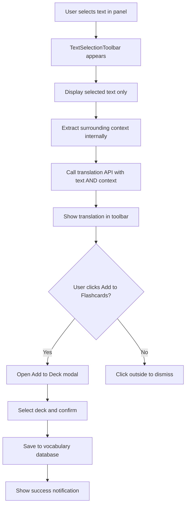
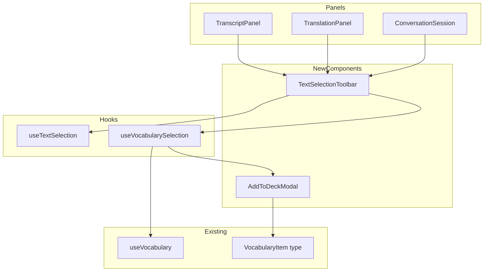

# Flashcard Text Selection Feature

## Status: ✅ COMPLETED

## Overview

This feature allows users to highlight text in transcription, translation, and conversation panels, see a popup toolbar with the selected text and its context-aware translation, and add the word/phrase to their flashcard deck.

**Important:** The toolbar displays only the selected text and its translation. The surrounding context is extracted internally and sent to the translation API for accuracy, but is NOT displayed in the UI.

## User Flow



## Architecture

### Component Structure



## Implementation Details

### 1. TextSelectionToolbar Component

**Location:** `src/components/TextSelectionToolbar.tsx`

**Purpose:** A floating popup that appears when text is selected, showing:
- The selected text (only the highlighted portion)
- Context-aware translation (fetched using surrounding context internally)
- Add to Flashcards button

**Note:** The surrounding context is NOT displayed in the UI. It is extracted internally and sent to the translation API for accuracy.

**Props:**
```typescript
interface TextSelectionToolbarProps {
  selectedText: string;
  context: string;           // Surrounding context for translation API (not displayed)
  sourceLanguage: string;
  targetLanguage: string;
  onAddToFlashcards: (word: string, translation: string, context: string) => void;
  onDismiss: () => void;
  position: { x: number; y: number };
}
```

**UI Design:**
- Floating card with shadow and rounded corners
- Appears near the selection position
- Shows loading state while translating
- Displays selected text and its translation (not the surrounding context)
- Displays translation with edit capability
- Add to Flashcards button with deck selector

### 2. useTextSelection Hook

**Location:** `src/hooks/useTextSelection.ts`

**Purpose:** Detects text selection within a container and provides:
- Selected text (for display)
- Selection position (for toolbar placement)
- Surrounding context (for translation API, not for display)

**Return Values:**
```typescript
interface UseTextSelectionReturn {
  selectedText: string | null;
  context: string | null;           // Surrounding context for translation API
  position: { x: number; y: number } | null;
  selectionRef: React.RefObject<HTMLElement>;
  clearSelection: () => void;
}
```

**Implementation Notes:**
- Listen for `mouseup` and `touchend` events
- Use `window.getSelection()` to get selected text
- Calculate position based on selection bounding rect
- Extract surrounding context from the container text (internal use only)

### 3. useVocabularySelection Hook

**Location:** `src/hooks/useVocabularySelection.ts`

**Purpose:** Handles the vocabulary addition workflow:
- Translates selected text with context
- Manages deck selection
- Adds item to vocabulary database

**Return Values:**
```typescript
interface UseVocabularySelectionReturn {
  translation: string;
  isTranslating: boolean;
  decks: LanguageDeck[];
  currentDeck: LanguageDeck | null;
  setCurrentDeck: (deck: LanguageDeck) => void;
  addToFlashcards: (word: string, translation: string, context: string) => Promise<void>;
  error: string | null;
}
```

### 4. Context-Aware Translation API Enhancement

**Location:** `src/app/api/translate/route.ts` (modify existing)

**Enhancement:** Add support for context-aware translation:
- Accept optional `context` parameter
- Modify prompt to include context for better translation accuracy

**New Prompt Template:**
```
Translate the following {source_language} text to {target_language}.
Context: {context}

Text to translate: {text}

Provide only the translation, no explanations.
```

### 5. SelectableText Wrapper Component

**Location:** `src/components/SelectableText.tsx`

**Purpose:** A reusable wrapper that makes any text content selectable with toolbar support.

**Props:**
```typescript
interface SelectableTextProps {
  children: React.ReactNode;
  sourceLanguage: string;
  targetLanguage: string;
  onAddToFlashcards: (word: string, translation: string, context: string) => Promise<void>;
  className?: string;
}
```

### 6. Panel Updates

#### TranscriptPanel Updates

**Changes:**
- Wrap message content in `SelectableText` component
- Pass `sourceLanguage` from props
- Add `onAddToFlashcards` callback prop
- Handle vocabulary addition with source='transcript'

#### TranslationPanel Updates

**Changes:**
- Wrap message content in `SelectableText` component
- Pass `sourceLanguage` and `targetLanguage` from props
- Add `onAddToFlashcards` callback prop
- Handle vocabulary addition with source='translation'

#### ConversationSession Updates

**Changes:**
- Wrap message bubbles in `SelectableText` component
- Use conversation language from session
- Add `onAddToFlashcards` callback prop
- Handle vocabulary addition with source='conversation'

### 7. AddToDeckModal Component

**Location:** `src/components/AddToDeckModal.tsx`

**Purpose:** Modal for confirming flashcard addition with:
- Selected word/phrase display
- Editable translation
- Deck selector dropdown
- Context stored internally (not displayed)
- Confirm/Cancel buttons

**Props:**
```typescript
interface AddToDeckModalProps {
  isOpen: boolean;
  word: string;
  translation: string;
  context: string;
  sourceLanguage: string;
  decks: LanguageDeck[];
  currentDeck: LanguageDeck | null;
  onSelectDeck: (deck: LanguageDeck) => void;
  onConfirm: () => Promise<void>;
  onCancel: () => void;
  isAdding: boolean;
}
```

## File Changes Summary

### New Files
| File | Purpose |
|------|---------|
| `src/components/TextSelectionToolbar.tsx` | Floating toolbar component |
| `src/components/SelectableText.tsx` | Reusable selectable text wrapper |
| `src/components/AddToDeckModal.tsx` | Modal for adding to flashcards |
| `src/hooks/useTextSelection.ts` | Text selection detection hook |
| `src/hooks/useVocabularySelection.ts` | Vocabulary workflow hook |

### Modified Files
| File | Changes |
|------|---------|
| `src/components/TranscriptPanel.tsx` | Add SelectableText wrapper |
| `src/components/TranslationPanel.tsx` | Add SelectableText wrapper |
| `src/components/ConversationSession.tsx` | Add SelectableText wrapper |
| `src/app/api/translate/route.ts` | Add context parameter support |
| `src/lib/constants.ts` | Add context-aware translation prompt |

## Technical Considerations

### Selection Positioning
- Use `Range.getBoundingClientRect()` for accurate positioning
- Handle scroll position offset
- Account for viewport boundaries
- Support touch devices

### Context Extraction
- Get parent container text content
- Find selection start/end indices
- Extract N words before and after (configurable, default 5)
- Handle edge cases (start/end of text)

### Translation Caching
- Cache translations for repeated selections
- Use Map with text+context as key
- Clear cache on language change

### Performance
- Debounce selection events (300ms)
- Cancel pending translations on new selection
- Use React.memo for toolbar component

### Accessibility
- Keyboard support for toolbar (Escape to dismiss)
- ARIA labels for all interactive elements
- Focus management for modal

## Testing Strategy

### Unit Tests
1. `useTextSelection` - selection detection, context extraction
2. `useVocabularySelection` - translation, deck management
3. `TextSelectionToolbar` - rendering, interactions
4. `AddToDeckModal` - form validation, submission

### Integration Tests
1. End-to-end selection to flashcard addition
2. Multi-panel selection behavior
3. Language switching during selection

### E2E Tests
1. User selects text in transcript → adds to flashcard
2. User selects text in translation → adds to flashcard
3. User selects text in conversation → adds to flashcard

## Implementation Order

1. **Phase 1: Core Infrastructure** ✅ COMPLETED
   - Create `useTextSelection` hook → `src/hooks/useTextSelection.ts`
   - Create `useVocabularySelection` hook → `src/hooks/useVocabularySelection.ts`
   - Add context parameter to translation API → `src/app/api/translate/route.ts`

2. **Phase 2: UI Components** ✅ COMPLETED
   - Create `TextSelectionToolbar` component → `src/components/TextSelectionToolbar.tsx`
   - Create `SelectableText` wrapper component → `src/components/SelectableText.tsx`
   - Note: AddToDeckModal functionality integrated into TextSelectionToolbar

3. **Phase 3: Panel Integration** ✅ COMPLETED
   - Update `TranscriptPanel` → `src/components/TranscriptPanel.tsx`
   - Update `TranslationPanel` → `src/components/TranslationPanel.tsx`
   - Update `ConversationSession` → `src/components/ConversationSession.tsx`

4. **Phase 4: Polish & Testing** ✅ COMPLETED
   - Add translation caching (in `useVocabularySelection.ts`)
   - Add accessibility features (keyboard support in toolbar)
   - Write tests → `src/hooks/__tests__/useTextSelection.test.ts`, `src/hooks/__tests__/useVocabularySelection.test.ts`
   - Update documentation

## Files Created/Modified

### New Files
| File | Description |
|------|-------------|
| `src/hooks/useTextSelection.ts` | Hook for detecting text selection and extracting context |
| `src/hooks/useVocabularySelection.ts` | Hook for translation and vocabulary workflow |
| `src/components/TextSelectionToolbar.tsx` | Floating toolbar component for text selection |
| `src/components/SelectableText.tsx` | Reusable wrapper for text selection |
| `src/hooks/__tests__/useTextSelection.test.ts` | Tests for useTextSelection hook |
| `src/hooks/__tests__/useVocabularySelection.test.ts` | Tests for useVocabularySelection hook |

### Modified Files
| File | Changes |
|------|---------|
| `src/app/api/translate/route.ts` | Added context parameter support |
| `src/components/TranscriptPanel.tsx` | Added SelectableText wrapper with sourceLanguage/targetLanguage props |
| `src/components/TranslationPanel.tsx` | Added SelectableText wrapper with sourceLanguage/targetLanguage props |
| `src/components/ConversationSession.tsx` | Added SelectableText wrapper with sourceLanguage/targetLanguage props |
| `src/app/page.tsx` | Added sourceLanguage prop to TranscriptPanel and TranslationPanel |
| `src/app/conversation/page.tsx` | Added sourceLanguage and targetLanguage props to ConversationSession |

## Dependencies

No new external dependencies required. Uses existing:
- React hooks
- Zustand stores
- Vocabulary database
- Translation API

## Usage

### For Users
1. Navigate to Transcribe, Translation, or Conversation page
2. Select any text in the transcript/translation/conversation panels
3. A popup toolbar appears showing the selected text and its translation
4. Edit the translation if needed
5. Click "Add to Flashcards" to save to your vocabulary deck

### For Developers
```tsx
import { SelectableText } from '@/components/SelectableText';

// Wrap any text content to make it selectable
<SelectableText
  sourceLanguage="es"
  targetLanguage="en"
  source="transcript"
  onAddToFlashcards={() => console.log('Added!')}
>
  <p>Your text content here</p>
</SelectableText>
```