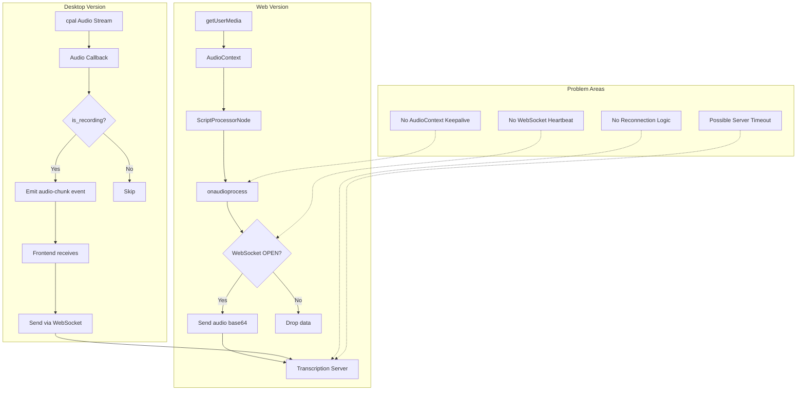

# Microphone Stops Working During Silence - Analysis & Fix Plan

## Problem Description

When the user starts recording and then remains silent (doesn't speak), the microphone stops working or stops sending data for transcription. This affects both the web and desktop (Tauri) versions.

## Requirements

1. **Fix all identified issues** causing the mic to stop during silence
2. **Add debug notifications** for desktop version to help diagnose issues during development

---

## Root Cause Analysis

After analyzing the codebase, I've identified **multiple potential causes**:

### 1. WebSocket Connection Timeout (Primary Suspect)

**Location**: [`src/hooks/useRealtimeTranscription.ts`](src/hooks/useRealtimeTranscription.ts:177-197)

The WebSocket connection has no keepalive mechanism:

```typescript
// Line 177-197: WebSocket is created but no ping/pong
const ws = new WebSocket(wsUrl);
wsRef.current = ws;
// ... no heartbeat implementation
```

**The Problem**:
- During silence, no audio data is sent through WebSocket
- Many WebSocket servers and proxies timeout idle connections (typically 30-60 seconds)
- The `WEBSOCKET_CONFIG.pingInterval: 30000` constant exists in [`src/lib/constants.ts:135`](src/lib/constants.ts:135) but is **NOT IMPLEMENTED**

### 2. Browser AudioContext Auto-Suspend

**Location**: [`src/hooks/useRealtimeTranscription.ts`](src/hooks/useRealtimeTranscription.ts:201-203)

```typescript
const audioContext = new AudioContext({ sampleRate: REALTIME_AUDIO.sampleRate });
```

**The Problem**:
- Modern browsers may suspend `AudioContext` after periods of inactivity
- Chrome's autoplay policy can suspend audio contexts
- When suspended, the `ScriptProcessorNode` stops firing `onaudioprocess` events

### 3. Server-Side Connection Cleanup

**Location**: The transcription server (Speaches/faster-whisper)

**The Problem**:
- The backend server may have an inactivity timeout
- If no audio is received for N seconds, it may close the connection
- This would cause the WebSocket to close unexpectedly

### 4. No Error Recovery Mechanism

**Location**: [`src/hooks/useRealtimeTranscription.ts`](src/hooks/useRealtimeTranscription.ts:189-197)

```typescript
ws.onerror = () => {
  ws.close();
};
// No reconnection logic
```

**The Problem**:
- When WebSocket closes due to timeout, there's no automatic reconnection
- The user must manually stop and restart recording

### 5. Desktop Audio Stream Considerations

**Location**: [`src-tauri/src/lib.rs`](src-tauri/src/lib.rs:241-283)

The desktop version uses `cpal` for audio capture:

```rust
// Line 246: Audio callback checks recording flag
if !is_recording.load(Ordering::SeqCst) { return; }
```

**Potential Issues**:
- Some audio backends may stop delivering frames during silence
- No visible error handling for stream interruptions

---

## Architecture Flow Diagram



---

## Implementation Plan

### Phase 1: Add Debug Notification System

**Files to create/modify**:
- [`src/types/notifications.ts`](src/types/notifications.ts) - Add 'debug' notification type
- [`src/contexts/NotificationContext.tsx`](src/contexts/NotificationContext.tsx) - Add debug notification helper
- [`src/components/NotificationToast.tsx`](src/components/NotificationToast.tsx) - Add debug styling

**Changes**:
1. Add 'debug' to `NotificationType` union type
2. Add `notifyDebug` function to notification context
3. Add debug notification styling (info icon, blue/gray colors)
4. Only show debug notifications in development mode

### Phase 2: WebSocket Keepalive

**Files to modify**:
- [`src/hooks/useRealtimeTranscription.ts`](src/hooks/useRealtimeTranscription.ts)

**Changes**:
1. Add `useRef` for ping interval timer
2. Implement `startPingInterval()` function
3. Send `input_audio_buffer.append` with empty/silent audio as heartbeat
4. Clear interval on stop and cleanup
5. Add debug notification when ping is sent

### Phase 3: Connection Health Monitoring

**Files to modify**:
- [`src/hooks/useRealtimeTranscription.ts`](src/hooks/useRealtimeTranscription.ts)

**Changes**:
1. Track `lastMessageTime` ref
2. Add `connectionHealthCheck` interval
3. If no message received for 60+ seconds, trigger reconnect
4. Add debug notification for connection health status

### Phase 4: AudioContext State Management

**Files to modify**:
- [`src/hooks/useRealtimeTranscription.ts`](src/hooks/useRealtimeTranscription.ts)

**Changes**:
1. Check `audioContext.state` before processing
2. Call `audioContext.resume()` if state is `suspended`
3. Add visibility change listener to resume on tab focus
4. Add debug notification when AudioContext is suspended/resumed

### Phase 5: Auto-Reconnect Logic

**Files to modify**:
- [`src/hooks/useRealtimeTranscription.ts`](src/hooks/useRealtimeTranscription.ts)

**Changes**:
1. Add `reconnectAttempts` counter
2. Implement `attemptReconnect()` with exponential backoff
3. Use `WEBSOCKET_CONFIG.maxRetries` (3 attempts)
4. Add debug notification for reconnection attempts

### Phase 6: Desktop Audio Stream Monitoring

**Files to modify**:
- [`src-tauri/src/lib.rs`](src-tauri/src/lib.rs)

**Changes**:
1. Add error event emission for audio stream errors
2. Add periodic audio stream health check
3. Emit debug events for stream state changes

---

## Detailed Code Changes

### 1. Notification Types Update

**File**: [`src/types/notifications.ts`](src/types/notifications.ts)

```typescript
// Add 'debug' to the NotificationType union
export type NotificationType = 'xp' | 'achievement' | 'level-up' | 'streak' | 'debug';

// Add debug notification interface
export interface DebugNotification extends Omit<Notification, 'type'> {
  type: 'debug';
  category: 'websocket' | 'audio' | 'connection' | 'general';
}
```

### 2. Notification Context Update

**File**: [`src/contexts/NotificationContext.tsx`](src/contexts/NotificationContext.tsx)

```typescript
// Add to DEFAULT_DURATIONS
const DEFAULT_DURATIONS: Record<NotificationType, number> = {
  xp: 2000,
  achievement: 4000,
  'level-up': 5000,
  streak: 3000,
  debug: 5000, // Longer duration for debug messages
};

// Add notifyDebug function
const notifyDebug = useCallback((
  title: string,
  message: string,
  category: 'websocket' | 'audio' | 'connection' | 'general' = 'general'
) => {
  // Only show in development mode
  if (process.env.NODE_ENV !== 'development' && !window.location.hostname.includes('localhost')) {
    return '';
  }
  
  return addNotification({
    type: 'debug',
    title: `🔧 ${title}`,
    message,
    icon: '🔧',
    duration: 5000,
  });
}, [addNotification]);
```

### 3. Notification Toast Styling

**File**: [`src/components/NotificationToast.tsx`](src/components/NotificationToast.tsx)

```typescript
// Add to typeStyles
const typeStyles: Record<NotificationType, { bg: string; border: string; iconBg: string }> = {
  // ... existing styles
  debug: {
    bg: 'bg-slate-50 dark:bg-slate-900/20',
    border: 'border-slate-300 dark:border-slate-700',
    iconBg: 'bg-slate-100 dark:bg-slate-800/50',
  },
};
```

### 4. Realtime Transcription Hook Updates

**File**: [`src/hooks/useRealtimeTranscription.ts`](src/hooks/useRealtimeTranscription.ts)

```typescript
// Add new imports
import { useNotifications } from '@/contexts/NotificationContext';

// Add new refs
const lastMessageTimeRef = useRef<number>(Date.now());
const pingIntervalRef = useRef<ReturnType<typeof setInterval> | null>(null);
const healthCheckIntervalRef = useRef<ReturnType<typeof setInterval> | null>(null);
const reconnectAttemptsRef = useRef<number>(0);
const connectionStateRef = useRef<'connected' | 'reconnecting' | 'disconnected'>('disconnected');

// Get notification context (only in development)
const { notifyDebug } = useNotifications();

// Debug notification helper
const debugNotify = useCallback((title: string, message: string, category: 'websocket' | 'audio' | 'connection' | 'general' = 'general') => {
  if (typeof window !== 'undefined' && notifyDebug) {
    notifyDebug(title, message, category);
  }
}, [notifyDebug]);

// Add ping/pong mechanism
const startKeepalive = useCallback((ws: WebSocket) => {
  pingIntervalRef.current = setInterval(() => {
    if (ws.readyState === WebSocket.OPEN) {
      // Send silent audio buffer as keepalive
      ws.send(JSON.stringify({ type: 'input_audio_buffer.append', audio: '' }));
      debugNotify('WebSocket Ping', 'Sent keepalive ping', 'websocket');
    }
  }, WEBSOCKET_CONFIG.pingInterval);
}, [debugNotify]);

// Add health check
const startHealthCheck = useCallback(() => {
  healthCheckIntervalRef.current = setInterval(() => {
    const now = Date.now();
    const elapsed = now - lastMessageTimeRef.current;
    
    if (elapsed > WEBSOCKET_CONFIG.connectionTimeout) {
      debugNotify('Connection Stale', `No message for ${Math.round(elapsed / 1000)}s, reconnecting...`, 'connection');
      handleReconnect();
    }
  }, 10000); // Check every 10 seconds
}, [debugNotify]);

// Add AudioContext state check
const ensureAudioContextRunning = useCallback(() => {
  if (audioContextRef.current?.state === 'suspended') {
    debugNotify('AudioContext Suspended', 'Attempting to resume AudioContext', 'audio');
    audioContextRef.current.resume();
  }
}, [debugNotify]);

// Add reconnection logic
const handleReconnect = useCallback(async () => {
  if (reconnectAttemptsRef.current >= WEBSOCKET_CONFIG.maxRetries) {
    debugNotify('Reconnect Failed', 'Max retries reached, stopping', 'connection');
    stopTranscription();
    return;
  }
  
  reconnectAttemptsRef.current += 1;
  connectionStateRef.current = 'reconnecting';
  
  debugNotify('Reconnecting', `Attempt ${reconnectAttemptsRef.current}/${WEBSOCKET_CONFIG.maxRetries}`, 'connection');
  
  // Clean up existing connection
  if (wsRef.current) {
    wsRef.current.close();
  }
  
  // Wait with exponential backoff
  const delay = WEBSOCKET_CONFIG.retryDelay * Math.pow(2, reconnectAttemptsRef.current - 1);
  await new Promise(resolve => setTimeout(resolve, delay));
  
  // Attempt to reconnect
  try {
    await setupRealtimeTranscription();
    reconnectAttemptsRef.current = 0;
    connectionStateRef.current = 'connected';
    debugNotify('Reconnected', 'Successfully reconnected to server', 'connection');
  } catch (err) {
    debugNotify('Reconnect Failed', `${err}`, 'connection');
    handleReconnect();
  }
}, [debugNotify, setupRealtimeTranscription, stopTranscription]);

// Add visibility change listener
useEffect(() => {
  const handleVisibilityChange = () => {
    if (document.visibilityState === 'visible' && isTranscribing) {
      ensureAudioContextRunning();
      debugNotify('Tab Visible', 'Resuming AudioContext if suspended', 'audio');
    }
  };
  
  document.addEventListener('visibilitychange', handleVisibilityChange);
  return () => {
    document.removeEventListener('visibilitychange', handleVisibilityChange);
  };
}, [isTranscribing, ensureAudioContextRunning, debugNotify]);

// Update onaudioprocess to check AudioContext state
processor.onaudioprocess = (event) => {
  // Check AudioContext state
  ensureAudioContextRunning();
  
  if (!wsRef.current || wsRef.current.readyState !== WebSocket.OPEN) {
    return;
  }
  
  // Update last message time
  lastMessageTimeRef.current = Date.now();
  
  const inputData = event.inputBuffer.getChannelData(0);
  // ... rest of processing
};
```

### 5. Desktop Audio Stream Debug Events

**File**: [`src-tauri/src/lib.rs`](src-tauri/src/lib.rs)

```rust
// Add debug event emission in build_audio_stream function
let stream = match config.sample_format() {
    SampleFormat::F32 => {
        device.build_input_stream(
            &stream_config,
            move |data: &[f32], _: &_| {
                if !is_recording.load(Ordering::SeqCst) { return; }
                
                // Debug: Periodically log stream health
                // (Only in debug builds)
                #[cfg(debug_assertions)]
                {
                    // Every 1000 frames, emit a debug event
                    // This helps verify the stream is still active
                }
                
                let bytes: Vec<u8> = data.iter()
                    .flat_map(|&s| s.to_le_bytes())
                    .collect();
                let _ = app_data.emit("audio-chunk", AudioChunk {
                    data: bytes,
                    sample_rate,
                    channels,
                    source: source.clone(),
                });
            },
            err_fn,
            None,
        )
    }
    // ... similar for I16
};
```

---

## Testing Plan

### Manual Testing

1. **WebSocket Keepalive Test**:
   - Start recording, remain silent for 2+ minutes
   - Verify debug notification shows "WebSocket Ping" every 30 seconds
   - Verify speaking after silence still transcribes

2. **AudioContext Suspend Test**:
   - Start recording, switch to another tab for 30+ seconds
   - Return to the tab and speak
   - Verify debug notification shows "AudioContext Suspended" then "Resuming"
   - Verify transcription continues

3. **Connection Recovery Test**:
   - Start recording
   - Disconnect network for 10 seconds
   - Reconnect network
   - Verify debug notification shows reconnection attempts
   - Verify transcription resumes

4. **Desktop Audio Stream Test**:
   - Start recording in desktop app
   - Remain silent for 2+ minutes
   - Verify audio stream continues emitting events

### Browser Console Testing

```javascript
// Monitor WebSocket state
setInterval(() => {
  console.log('WebSocket state:', wsRef?.current?.readyState);
  console.log('AudioContext state:', audioContextRef?.current?.state);
}, 5000);
```

### Edge Cases

- Network interruption during silence
- Tab backgrounding during silence
- System sleep/wake during recording
- Browser throttling in background tabs

---

## Files Changed Summary

| File | Changes |
|------|---------|
| `src/types/notifications.ts` | Add 'debug' notification type |
| `src/contexts/NotificationContext.tsx` | Add `notifyDebug` function |
| `src/components/NotificationToast.tsx` | Add debug notification styling |
| `src/hooks/useRealtimeTranscription.ts` | Add keepalive, health check, AudioContext management, reconnection logic |
| `src-tauri/src/lib.rs` | Add debug event emission for audio stream |
| `src/lib/constants.ts` | No changes needed (constants already exist) |

---

## Implementation Order

1. **Phase 1**: Debug Notification System (foundation for debugging)
2. **Phase 2**: WebSocket Keepalive (most likely fix)
3. **Phase 3**: AudioContext State Management (browser-specific fix)
4. **Phase 4**: Connection Health Monitoring (proactive detection)
5. **Phase 5**: Auto-Reconnect Logic (recovery mechanism)
6. **Phase 6**: Desktop Audio Stream Monitoring (Tauri-specific)

Each phase can be tested independently before moving to the next.