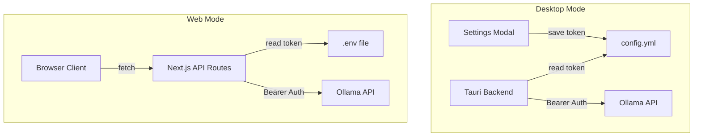
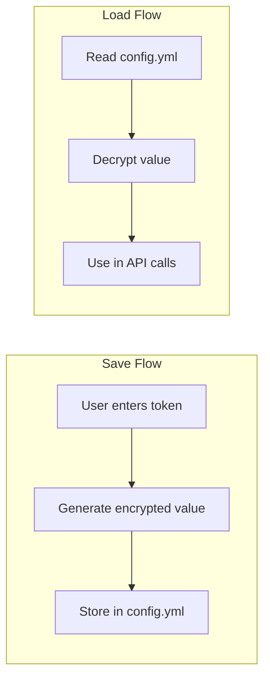

# Ollama API Key Support Plan

## Overview

This plan addresses adding comprehensive API key support for Ollama across both Web and Desktop modes, with a focus on Bearer authentication.

## Configuration Methods by Mode

| Mode | Configuration Method | Storage Location |
|------|---------------------|------------------|
| **Web** | Environment Variables | `.env` file on server |
| **Desktop** | Settings UI → config.yml | `config.yml` next to executable |

**Important:** Desktop mode does NOT use environment variables. Users configure settings through the Settings Modal which persists to `config.yml`.

## Current State Analysis

### What's Already Working

| Component | File | Status |
|-----------|------|--------|
| Environment Variables | `.env.example` | ✅ Has `OLLAMA_API_TOKEN` (for Web mode) |
| Config File | `config.example.yml` | ✅ Has `ollama_api_token: null` (for Desktop mode) |
| Translate API | [`src/app/api/translate/route.ts`](src/app/api/translate/route.ts:99-103) | ✅ Uses bearer auth |
| Summarize API | [`src/app/api/summarize/route.ts`](src/app/api/summarize/route.ts:81-85) | ✅ Uses bearer auth |
| Config API | [`src/app/api/config/route.ts`](src/app/api/config/route.ts:117) | ⚠️ Exposes token to client |
| Tauri Translate | [`src-tauri/src/lib.rs`](src-tauri/src/lib.rs:458-460) | ✅ Uses bearer auth from config |
| Tauri Summarize | [`src-tauri/src/lib.rs`](src-tauri/src/lib.rs:591-593) | ✅ Uses bearer auth from config |
| Tauri Conversation | [`src-tauri/src/lib.rs`](src-tauri/src/lib.rs:734-736) | ✅ Uses bearer auth from config |

### What's Missing/Broken

| Component | File | Issue |
|-----------|------|-------|
| Conversation API | [`src/app/api/conversation/route.ts`](src/app/api/conversation/route.ts:37-53) | ❌ No API token support |
| Settings Modal | [`src/components/SettingsModal.tsx`](src/components/SettingsModal.tsx:9-16) | ❌ No `ollama_api_token` field for desktop users |

## Architecture



## Implementation Plan

### Phase 1: Fix Conversation API Route

**File:** [`src/app/api/conversation/route.ts`](src/app/api/conversation/route.ts)

The conversation route needs to:
1. Load config from file (similar to translate/summarize routes)
2. Read API token from env var or config
3. Add Bearer auth header to Ollama fetch request

```typescript
// Current code (lines 14-15):
const OLLAMA_BASE_URL = process.env.OLLAMA_BASE_URL || DEFAULT_OLLAMA_CONFIG.baseUrl;
const OLLAMA_MODEL = process.env.OLLAMA_CONVERSATION_MODEL || DEFAULT_OLLAMA_CONFIG.translateModel;

// Needs to be updated to load config and use API token
```

### Phase 2: Add API Token to Settings Modal

**File:** [`src/components/SettingsModal.tsx`](src/components/SettingsModal.tsx)

Changes needed:
1. Add `ollama_api_token` to `Settings` interface
2. Add password input field in the UI
3. Update load/save logic to handle the token

### Phase 3: Security - Remove Token from Config API Response

**File:** [`src/app/api/config/route.ts`](src/app/api/config/route.ts:117)

The `ollamaApiToken` should NOT be exposed to the client. The config API is called by the browser, and exposing the token is a security risk.

**Current:**
```typescript
ollamaApiToken: process.env.OLLAMA_API_TOKEN ?? fileConfig.ollama_api_token ?? null,
```

**Should be removed from response** - tokens should only be used server-side.

### Phase 4: Update Documentation

**Files:**
- `.env.example` - Add better documentation
- `config.example.yml` - Add better documentation

## Detailed Task List

### 1. Fix Conversation API Route
- [ ] Add config loading function (reuse pattern from translate/summarize)
- [ ] Read `OLLAMA_API_TOKEN` from environment or config file
- [ ] Add `Authorization: Bearer <token>` header to fetch request
- [ ] Handle missing token gracefully (no auth header if no token)

### 2. Add API Token to Settings Modal
- [ ] Add `ollama_api_token: string` to `Settings` interface
- [ ] Add password input field with show/hide toggle
- [ ] Update `loadSettings` to load token from config
- [ ] Update `handleSave` to save token to config
- [ ] Add placeholder text explaining the field is optional

### 3. Security Fix - Config API
- [ ] Remove `ollamaApiToken` from config API response
- [ ] Verify no other sensitive data is exposed

### 4. Update Documentation
- [ ] Update `.env.example` with clear comments about API token usage
- [ ] Update `config.example.yml` with clear comments about API token
- [ ] Add note about security (token stored in plain text on desktop)

### 5. Testing
- [ ] Add test for conversation API with API token
- [ ] Add test for conversation API without API token
- [ ] Verify translate/summarize routes still work
- [ ] Test desktop settings save/load with API token

## API Token Configuration Options

Users can configure the Ollama API token in the following ways:

### Web Mode (Server-Side Only)
| Method | Location | Priority |
|--------|----------|----------|
| Environment Variable | `.env` file: `OLLAMA_API_TOKEN=your_token_here` | 1st (highest) |
| Config File | `config.yml` on server: `ollama_api_token: "your_token_here"` | 2nd |

**Note:** In web mode, the API token is never sent to the browser. It's used server-side only.

### Desktop Mode (Tauri)
| Method | Location | Priority |
|--------|----------|----------|
| Settings UI | Settings Modal → API Token field | Saves encrypted to config.yml |
| Config File | `config.yml` next to executable | Encrypted value read on app start |

**Note:** Desktop mode uses `config.yml` as the primary configuration source. The API token is **encrypted at rest** to prevent casual reading.

## Encryption for Desktop Mode

The API token stored in `config.yml` will be encrypted using a machine-specific key to prevent casual reading of the token.

### Encryption Approach



### Implementation Details

1. **Encryption Method:** Use AES-256-GCM with a machine-specific key derived from:
   - Machine ID (via `machine-uid` crate or similar)
   - Application salt

2. **Storage Format:** Store encrypted token with a prefix to identify it's encrypted:
   ```yaml
   ollama_api_token: "enc:v1:aes256gcm:base64_encrypted_data"
   ```

3. **Backward Compatibility:**
   - Detect unencrypted tokens (no `enc:` prefix) and continue to support them
   - Re-encrypt plain tokens when config is saved

### Rust Crates Needed

Add to `src-tauri/Cargo.toml`:
```toml
[dependencies]
# For encryption
aes-gcm = "0.10"
base64 = "0.21"
# For machine-specific key
machine-uid = "0.5"
# Or use keyring for OS-level secure storage
keyring = "2.0"  # Alternative approach
```

### Alternative: OS Keyring

Instead of encrypting in config file, use the OS's native credential storage:
- **Windows:** Windows Credential Manager
- **macOS:** Keychain
- **Linux:** Secret Service (GNOME Keyring, KWallet)

This would use the `keyring` crate and is more secure but requires additional UI considerations.

## Bearer Auth Implementation

All Ollama API calls should include the Authorization header when a token is configured:

```typescript
const headers: Record<string, string> = {
  'Content-Type': 'application/json',
};

const apiToken = process.env.OLLAMA_API_TOKEN ?? config.ollama_api_token;
if (apiToken) {
  headers['Authorization'] = `Bearer ${apiToken}`;
}

const response = await fetch(url, {
  method: 'POST',
  headers,
  body: JSON.stringify(payload),
});
```

## Files to Modify

| File | Changes |
|------|---------|
| `src/app/api/conversation/route.ts` | Add config loading and bearer auth |
| `src/components/SettingsModal.tsx` | Add API token input field |
| `src/app/api/config/route.ts` | Remove `ollamaApiToken` from response |
| `.env.example` | Improve documentation |
| `config.example.yml` | Improve documentation |

## Files Already Correct (No Changes Needed)

| File | Reason |
|------|--------|
| `src/app/api/translate/route.ts` | Already uses bearer auth correctly |
| `src/app/api/summarize/route.ts` | Already uses bearer auth correctly |
| `src-tauri/src/lib.rs` | All Tauri commands use bearer auth |
| `src/lib/tauri.ts` | TypeScript types already include `ollama_api_token` |

## Security Considerations

1. **Desktop Mode:** The API token is **encrypted at rest** in `config.yml` using AES-256-GCM with a machine-specific key. This prevents casual reading of the token if someone opens the config file.

2. **Web Mode:** The API token should NEVER be sent to the browser. It should only be read server-side and used for server-to-server communication with Ollama.

3. **Config API:** Currently exposes the token - this is a security issue that needs to be fixed.

## Detailed Task List

### 1. Refactor Conversation API Route (Web Only)
**File:** `src/app/api/conversation/route.ts`

The Tauri version (`src-tauri/src/lib.rs`) already has bearer auth support. Only the Web API needs fixing.

- [ ] Replace raw `fetch` with `ollama` npm package (for consistency with translate/summarize)
- [ ] Add config loading function (reuse pattern from translate/summarize)
- [ ] Read `OLLAMA_API_TOKEN` from environment or config file
- [ ] Add bearer auth via Ollama client headers
- [ ] Handle missing token gracefully (no auth header if no token)
- [ ] Update tests to work with ollama package

**Note:** Tauri backend already has bearer auth at lines 734-736 in `lib.rs`.

### 2. Add API Token to Settings Modal
- [ ] Add `ollama_api_token: string` to `Settings` interface
- [ ] Add password input field with show/hide toggle
- [ ] Update `loadSettings` to load token from config (decrypt if needed)
- [ ] Update `handleSave` to save token to config (encrypt before saving)
- [ ] Add placeholder text explaining the field is optional

### 3. Security Fix - Config API
- [ ] Remove `ollamaApiToken` from config API response
- [ ] Verify no other sensitive data is exposed

### 4. Implement Encryption for Desktop Mode
- [ ] Add encryption dependencies to `src-tauri/Cargo.toml` (aes-gcm, base64, machine-uid)
- [ ] Create encryption module in `src-tauri/src/encryption.rs`
- [ ] Implement `encrypt_token()` function
- [ ] Implement `decrypt_token()` function
- [ ] Add encryption prefix format: `enc:v1:aes256gcm:<base64_data>`
- [ ] Update `save_config` to encrypt API token before saving
- [ ] Update `load_config` to decrypt API token after loading
- [ ] Handle backward compatibility for unencrypted tokens

### 5. Update Documentation
- [ ] Update `.env.example` with clear comments about API token usage
- [ ] Update `config.example.yml` with clear comments about API token
- [ ] Add note about encryption for desktop mode

### 6. Testing
- [ ] Add test for conversation API with API token
- [ ] Add test for conversation API without API token
- [ ] Verify translate/summarize routes still work
- [ ] Test desktop settings save/load with API token
- [ ] Test encryption/decryption round-trip
- [ ] Test backward compatibility with unencrypted tokens

## Acceptance Criteria

- [ ] Conversation API route uses API token with bearer auth
- [ ] Settings Modal allows desktop users to configure API token
- [ ] API token is encrypted at rest in desktop mode
- [ ] API token is not exposed to browser in web mode
- [ ] All three API routes (translate, summarize, conversation) work with and without API token
- [ ] Documentation clearly explains configuration options
- [ ] Tests pass for authenticated and unauthenticated scenarios
- [ ] Backward compatibility maintained for existing unencrypted tokens