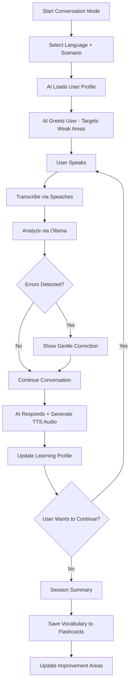
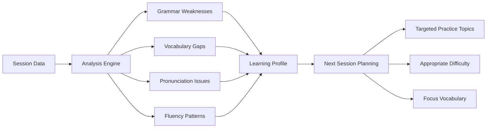
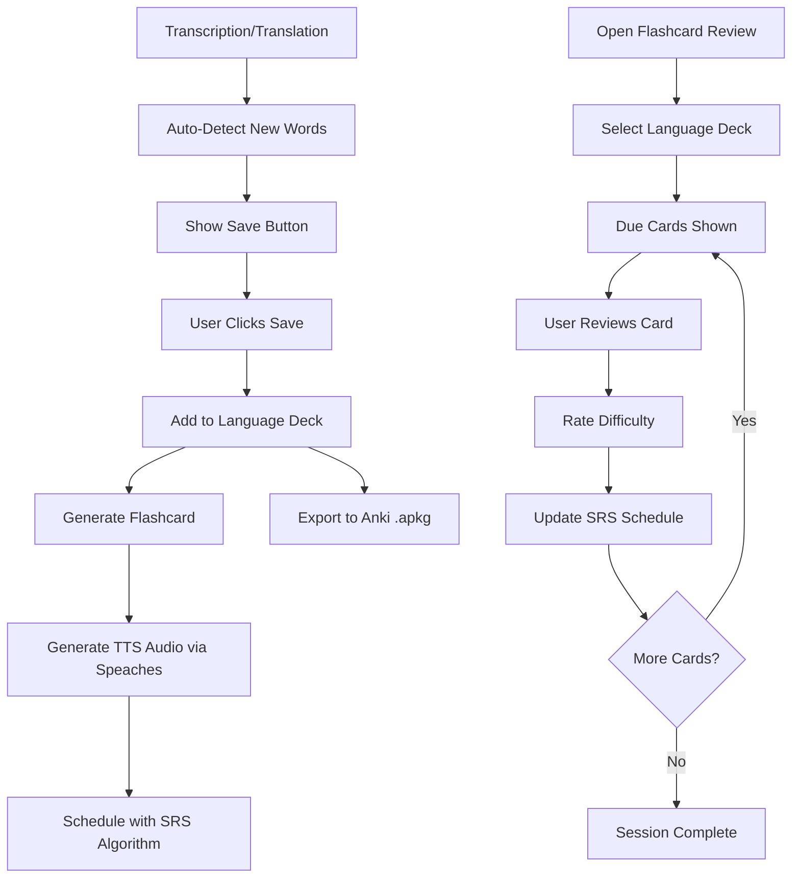
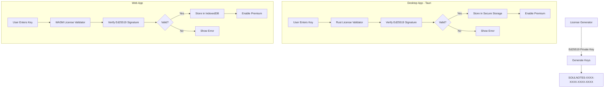
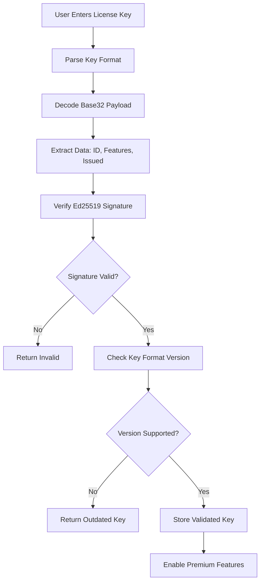

# SoulNotes Premium Features Plan

## Overview

Target users: **Professionals who want to learn languages while working** - attending multilingual meetings, conferences, or working with international teams while improving their language skills.

### Key Architecture Decisions
- **Offline-First** - All data stored locally, no cloud dependency
- **Ollama-Powered AI** - Uses existing LLM infrastructure for conversation and analysis
- **Speaches TTS** - Leverages Speaches for audio generation and pronunciation
- **Multi-Language Support** - Learn multiple languages simultaneously with separate decks

---

## Feature 1: AI Conversation Partner

### Description
An interactive AI conversation mode where users practice speaking in their target language. The AI responds naturally, provides gentle corrections, and **adaptively tailors practice based on tracked improvement areas**.

### User Flow



### Key Components

#### Scenario-Based Conversations
- **Business Meeting** - Practice professional discussions, presentations, negotiations
- **Casual Chat** - Everyday conversations, small talk, social situations
- **Technical Discussion** - Industry-specific vocabulary and concepts
- **Travel/Restaurant** - Practical travel scenarios
- **Custom Scenario** - User-defined context or topic

#### Difficulty Levels
- **Beginner** - Simple vocabulary, slow pace, more corrections
- **Intermediate** - Complex sentences, moderate pace, selective corrections
- **Advanced** - Native-level discourse, idioms, minimal corrections

#### Adaptive Learning System
The AI tracks user performance and tailors future sessions:



**Tracked Metrics:**
- **Grammar Patterns** - Which structures cause errors (e.g., verb conjugations, articles)
- **Vocabulary Gaps** - Words user struggled with or didn't know
- **Pronunciation Issues** - Sounds/words frequently mispronounced
- **Fluency Patterns** - Hesitation points, filler words, pace
- **Confidence Areas** - Topics where user performs well

**Adaptive Behaviors:**
- Prioritize weak grammar patterns in AI responses
- Introduce vocabulary related to gaps
- Slow down or repeat difficult phrases
- Build on strengths while addressing weaknesses
- Suggest specific practice scenarios

#### AI Response Features
- Natural conversational responses in target language
- **TTS Audio** - AI responses spoken via Speaches
- Optional translation of AI responses
- Pronunciation tips for difficult words
- Grammar explanations when mistakes are made
- Cultural context notes

#### Session Analytics
- Words spoken count
- Accuracy percentage
- Vocabulary introduced
- Grammar patterns practiced
- **Improvement areas identified**
- **Progress vs. previous sessions**

### Technical Implementation

**New Components Needed:**
- [`ConversationPanel.tsx`](src/components/ConversationPanel.tsx) - Main conversation UI
- [`useConversation.ts`](src/hooks/useConversation.ts) - Hook for conversation state management
- [`useLearningProfile.ts`](src/hooks/useLearningProfile.ts) - Hook for adaptive learning tracking
- [`/api/conversation`](src/app/api/conversation/route.ts) - Endpoint for AI conversation logic
- [`/api/tts`](src/app/api/tts/route.ts) - Endpoint for Speaches TTS audio generation

**API Integration:**
- Uses existing Ollama/LLM infrastructure
- Speaches for transcription AND text-to-speech
- New conversation prompt templates with user profile context
- Context management for multi-turn conversations
- Local storage for learning profiles

---

## Feature 2: Vocabulary Flashcard System

### Description
Automatically capture vocabulary from transcriptions, translations, and conversations. Built-in spaced repetition system (SRS) for learning, with Anki export capability. **Supports multiple languages simultaneously** with separate decks per language.

### User Flow



### Key Components

#### Multi-Language Support
- **Separate Decks** - Each language has its own vocabulary collection
- **Language Switching** - Easy toggle between language decks
- **Cross-Language Tracking** - See progress across all languages
- **Independent SRS** - Each language has its own review schedule

#### Vocabulary Capture
- **Auto-Detection** - Identify unfamiliar words based on user's known vocabulary
- **Manual Selection** - Click any word in transcript/translation to save
- **Context Preservation** - Store the sentence where word appeared
- **Auto-Translation** - Generate translation and definition automatically
- **TTS Audio Generation** - Generate pronunciation audio via Speaches

#### Flashcard Types
- **Basic** - Word → Translation
- **Reverse** - Translation → Word
- **Context** - Sentence with blank → Fill in word
- **Audio** - Hear word (TTS) → Type/spell it
- **Grammar** - Grammar pattern explanation

#### Spaced Repetition Algorithm
Based on SM-2 algorithm (same as Anki):
- Cards reviewed at optimal intervals
- Difficulty rating after each review
- Easy cards shown less frequently
- Difficult cards shown more often

#### Review Modes
- **Daily Review** - Due cards for the day (per language)
- **Quick Practice** - 5-minute sessions
- **Intensive** - Focus on difficult cards
- **Pre-Meeting Prep** - Review relevant vocabulary
- **Weak Areas** - AI-suggested cards based on learning profile

#### Gamification Elements
- **Streaks** - Consecutive days of practice (per language)
- **XP System** - Points for reviews, conversations, meetings
- **Levels** - Progress through language proficiency levels
- **Achievements** - Milestones and accomplishments
- **No Leaderboards** - Focus on personal progress, offline-first

### Data Model

```typescript
interface LanguageDeck {
  id: string;
  language: string;
  name: string;
  createdAt: Date;
  lastReviewedAt?: Date;
  stats: {
    totalWords: number;
    wordsLearned: number;
    dueToday: number;
  };
}

interface VocabularyItem {
  id: string;
  deckId: string; // Reference to LanguageDeck
  word: string;
  language: string;
  translation: string;
  definition?: string;
  context: string; // Original sentence
  source: 'transcript' | 'translation' | 'conversation' | 'manual';
  createdAt: Date;
  audioUrl?: string; // Local path to TTS-generated audio
  tags: string[];
}

interface Flashcard {
  id: string;
  vocabularyId: string;
  type: 'basic' | 'reverse' | 'context' | 'audio' | 'grammar';
  front: string;
  back: string;
  // SRS fields
  ease: number; // 1.3 - 2.5
  interval: number; // days
  dueDate: Date;
  reviewCount: number;
  lapseCount: number; // times forgotten
}

interface LearningProfile {
  language: string;
  // Tracked improvement areas
  grammarWeaknesses: Map<string, number>; // pattern -> error count
  vocabularyGaps: string[]; // unknown words encountered
  pronunciationIssues: Map<string, number>; // sound/word -> issue count
  fluencyScore: number; // 0-100
  confidenceAreas: string[]; // topics where user performs well
  lastUpdated: Date;
}

interface UserProgress {
  decks: LanguageDeck[];
  currentStreak: number;
  longestStreak: number;
  totalXP: number;
  level: number;
  achievements: Achievement[];
}
```

### Technical Implementation

**New Components:**
- [`VocabularyPanel.tsx`](src/components/VocabularyPanel.tsx) - Vocabulary list management
- [`FlashcardReview.tsx`](src/components/FlashcardReview.tsx) - Review session UI
- [`LanguageDeckSelector.tsx`](src/components/LanguageDeckSelector.tsx) - Multi-language deck switching
- [`useVocabulary.ts`](src/hooks/useVocabulary.ts) - Vocabulary management hook
- [`useFlashcards.ts`](src/hooks/useFlashcards.ts) - SRS logic and review state
- [`useGamification.ts`](src/hooks/useGamification.ts) - XP, streaks, achievements
- [`useLearningProfile.ts`](src/hooks/useLearningProfile.ts) - Adaptive learning tracking

**Storage (Offline-First):**
- Tauri storage API for desktop app (local file system)
- IndexedDB for web version
- No cloud sync - all data stays on device
- Export/import functionality for backup

**Anki Export:**
- Generate .apkg file format
- Include TTS-generated audio
- Include context sentences
- Preserve SRS scheduling data

---

## Feature 3: Meeting Vocabulary Report

### Description
After each meeting/transcription session, generate a vocabulary report highlighting new words, technical terms, and phrases worth learning.

### Components
- **Key Terms Extraction** - Identify important vocabulary from meeting
- **Frequency Analysis** - Show most-used words
- **Learning Priority** - Rank by usefulness
- **Quick Save** - One-click add to flashcards
- **Per-Language Reports** - Separate reports for each source language

---

## Feature 4: Pronunciation Practice

### Description
Practice pronunciation of saved words with AI feedback using Speaches TTS.

### Components
- **Listen & Repeat** - Hear TTS-generated pronunciation, record yourself
- **AI Scoring** - Rate pronunciation accuracy via Ollama analysis
- **Phonetic Guide** - Show IPA or simplified phonetics
- **Slow Mode** - TTS at reduced speed for difficult words
- **Weak Area Focus** - Prioritize words from learning profile's pronunciation issues

---

## Feature 5: Progress Dashboard

### Description
Visual overview of language learning progress across all languages.

### Components
- **Vocabulary Growth** - Chart of words learned over time per language
- **Conversation Time** - Hours practiced per language
- **Accuracy Trends** - Improvement over time
- **Meeting Stats** - Transcriptions, translations, vocabulary captured
- **Streak Calendar** - Visual streak tracking
- **Weak Areas Summary** - Grammar, vocabulary, pronunciation focus areas
- **Multi-Language Overview** - See progress across all language decks

---

## Premium Tier Structure

### Free Tier
- Basic transcription and translation
- **25 words per language deck** (learn multiple languages)
- Basic flashcard review
- No conversation mode
- No TTS audio generation
- No Anki export

### Premium Tier
- **Unlimited vocabulary storage**
- AI Conversation Partner with adaptive learning
- All flashcard types
- TTS audio generation via Speaches
- Anki export (.apkg)
- Pronunciation practice with AI feedback
- Progress dashboard with analytics
- Meeting vocabulary reports
- Learning profile tracking

---

## Implementation Priority

1. **Phase 1: Vocabulary System**
   - Word capture from transcripts/translations
   - Multi-language deck support
   - Basic flashcard storage
   - TTS audio generation via Speaches
   - Simple review mode

2. **Phase 2: SRS & Gamification**
   - Spaced repetition algorithm
   - Streaks and XP system
   - Progress tracking per language

3. **Phase 3: AI Conversation**
   - Basic conversation mode
   - Scenario selection
   - Correction system
   - Learning profile creation

4. **Phase 4: Adaptive Learning**
   - Weak area tracking
   - Tailored practice sessions
   - Meeting reports
   - Dashboard analytics

5. **Phase 5: Export & Advanced**
   - Anki export
   - Pronunciation practice
   - Import/export user data backup

---

## Technical Considerations

### Storage Strategy (Offline-First)
- Use Tauri's storage API for desktop persistence (local file system)
- IndexedDB for web version
- SQLite for complex queries (vocabulary search, SRS calculations, learning profiles)
- No cloud dependency - all data stays on device
- Export/import JSON for user backups

### Performance
- Lazy load vocabulary for large collections
- Background SRS calculations
- Efficient audio storage (compressed formats, cache TTS results)
- Indexed queries for fast deck filtering

### Privacy
- All vocabulary stored locally
- No cloud sync
- No data shared without consent
- User owns their data completely

### TTS Integration (Speaches)
- Generate audio on-demand for vocabulary items
- Cache generated audio locally
- Support multiple voices per language if available
- Slow-speed variant for pronunciation practice

---

## UI Design: Mode-Switching Header

### Description
A navigation header that allows users to switch between SoulNotes' different modes. **Each mode is a separate page for clean separation of concerns.**

### Page Routes

| Route | Mode | Description | Access |
|-------|------|-------------|--------|
| `/` or `/transcribe` | Transcribe | Live transcription, translation, summary | Free |
| `/conversation` | Conversation | AI conversation partner for language practice | Premium |
| `/flashcards` | Flashcards | Vocabulary review with spaced repetition | Free |
| `/dashboard` | Dashboard | Progress tracking, stats, learning profile | Premium |

### Header Layout

```
┌─────────────────────────────────────────────────────────────────────┐
│  SoulNotes    │ Transcribe │ Conversation │ Flashcards │ Dashboard │
│               │   [free]   │   [premium]  │   [free]   │ [premium] │
└─────────────────────────────────────────────────────────────────────┘
```

### Modes

| Mode | Description | Icon | Access |
|------|-------------|------|--------|
| **Transcribe** | Current functionality - live transcription, translation, summary | 🎤 | Free |
| **Conversation** | AI conversation partner for language practice | 💬 | Premium |
| **Flashcards** | Vocabulary review with spaced repetition | 📚 | Free |
| **Dashboard** | Progress tracking, stats, learning profile | 📊 | Premium |

### Header Component

```typescript
interface HeaderProps {
  isPremium: boolean;
}

// Premium-only modes are visually indicated but disabled for free users
const MODES = [
  { id: 'transcribe', label: 'Transcribe', icon: '🎤', premium: false, path: '/' },
  { id: 'conversation', label: 'Conversation', icon: '💬', premium: true, path: '/conversation' },
  { id: 'flashcards', label: 'Flashcards', icon: '📚', premium: false, path: '/flashcards' },
  { id: 'dashboard', label: 'Dashboard', icon: '📊', premium: true, path: '/dashboard' },
];
```

### Behavior
- **Free users** can access Transcribe and Flashcards pages
- **Premium modes** (Conversation, Dashboard) show a lock icon and prompt upgrade when clicked
- Active mode is highlighted with accent color
- Responsive design - collapses to icons on mobile
- **Next.js routing** for page navigation

### Technical Implementation

**New Pages:**
- [`src/app/page.tsx`](src/app/page.tsx) - Transcribe (existing, moved)
- [`src/app/conversation/page.tsx`](src/app/conversation/page.tsx) - Conversation mode
- [`src/app/flashcards/page.tsx`](src/app/flashcards/page.tsx) - Flashcard review
- [`src/app/dashboard/page.tsx`](src/app/dashboard/page.tsx) - Progress dashboard

**New Components:**
- [`src/components/AppHeader.tsx`](src/components/AppHeader.tsx) - Main navigation header
- [`src/components/ModeTab.tsx`](src/components/ModeTab.tsx) - Individual mode tab
- [`src/components/PremiumGate.tsx`](src/components/PremiumGate.tsx) - Wrapper that checks premium status

**Layout:**
- [`src/app/layout.tsx`](src/app/layout.tsx) - Updated to include AppHeader on all pages

---

## License Key Validation

### Overview
Premium features require a valid license key. Validation is **fully offline** using cryptographic verification in Rust (desktop) and WASM (web) for security through obfuscation.

### License Model
- **One-time purchase** - No subscription, lifetime access
- **Fully offline** - No server required for validation
- **Cross-platform** - Same key works on desktop and web

### License Key Format

```
SOULNOTES-XXXX-XXXX-XXXX-XXXX
```

- 4 groups of 4 alphanumeric characters
- Contains encoded metadata with cryptographic signature
- Ed25519 signature prevents forgery

### Architecture



### Validation Flow



### Security Implementation

#### Desktop (Tauri/Rust)
```rust
// src-tauri/src/license.rs
use ed25519_dalek::{PublicKey, Signature, Verifier};
use base32::{decode, Alphabet};

const PUBLIC_KEY: &[u8] = include_bytes!("public_key.bin");

pub struct License {
    pub key_id: String,
    pub features: Vec<String>,
    pub issued_at: u64,
}

pub fn validate_license(key: &str) -> Result<License, LicenseError> {
    // 1. Parse and decode key
    let clean_key = key.replace("SOULNOTES-", "").replace("-", "");
    let decoded = decode(Alphabet::RFC4648 { padding: false }, &clean_key)?;
    
    // 2. Extract signature and data
    let (data, signature) = split_payload(&decoded)?;
    
    // 3. Verify Ed25519 signature
    let public_key = PublicKey::from_bytes(PUBLIC_KEY)?;
    let sig = Signature::from_bytes(&signature)?;
    public_key.verify(&data, &sig)?;
    
    // 4. Parse license data
    let license = parse_license_data(&data)?;
    
    Ok(license)
}

#[tauri::command]
pub fn check_premium() -> bool {
    // Check if valid license exists in secure storage
}

#[tauri::command]
pub fn activate_license(key: String) -> Result<License, String> {
    validate_license(&key)
        .and_then(|license| store_license(&license))
        .map_err(|e| e.to_string())
}
```

#### Web (WASM)
```rust
// src-wasm/src/lib.rs
use wasm_bindgen::prelude::*;
use ed25519_dalek::{PublicKey, Signature, Verifier};

const PUBLIC_KEY: &[u8] = include_bytes!("public_key.bin");

#[wasm_bindgen]
pub fn validate_license_wasm(key: &str) -> Result<JsValue, JsValue> {
    // Same validation logic as desktop
    // Returns license data or error
}

#[wasm_bindgen]
pub fn check_premium_wasm() -> bool {
    // Check stored license in IndexedDB
}
```

### Key Generation (Admin Tool)

```rust
// Separate admin tool for generating keys
use ed25519_dalek::{Keypair, Signer};
use rand::rngs::OsRng;

fn generate_license_key(features: Vec<String>) -> String {
    let mut csprng = OsRng {};
    let keypair = Keypair::generate(&mut csprng);
    
    // Create license payload
    let payload = create_payload(features);
    
    // Sign with private key
    let signature = keypair.sign(&payload);
    
    // Encode as license key
    let combined = [payload, signature.to_bytes().to_vec()].concat();
    let encoded = base32::encode(Alphabet::RFC4648 { padding: false }, &combined);
    
    format!("SOULNOTES-{}", format_key(&encoded))
}

fn format_key(encoded: &str) -> String {
    // Format as XXXX-XXXX-XXXX-XXXX
    encoded
        .chars()
        .collect::<Vec<_>>()
        .chunks(4)
        .map(|c| c.iter().collect::<String>())
        .collect::<Vec<_>>()
        .join("-")
}
```

### Technical Implementation

**Desktop (Tauri):**
- [`src-tauri/src/license.rs`](src-tauri/src/license.rs) - Rust license validation
- [`src-tauri/src/lib.rs`](src-tauri/src/lib.rs) - Tauri commands for license
- Public key embedded in binary

**Web (WASM):**
- [`src-wasm/`](src-wasm/) - Rust compiled to WASM
- [`src-wasm/src/lib.rs`](src-wasm/src/lib.rs) - WASM license validation
- Public key embedded in WASM binary

**Frontend:**
- [`src/lib/license.ts`](src/lib/license.ts) - Platform detection and bridge
- [`src/hooks/useLicense.ts`](src/hooks/useLicense.ts) - License state management
- [`src/components/LicenseModal.tsx`](src/components/LicenseModal.tsx) - License entry UI
- [`src/components/PremiumGate.tsx`](src/components/PremiumGate.tsx) - Premium feature wrapper

**Storage:**
- Desktop: Tauri secure storage (OS keychain integration)
- Web: IndexedDB with encrypted payload

### Security Considerations

| Threat | Mitigation |
|--------|------------|
| Key sharing | Keys are not hardware-bound (acceptable for one-time purchase) |
| Key forgery | Ed25519 signature verification |
| Memory inspection | Validation in Rust/WASM, not JavaScript |
| Storage tampering | Signature verified on every check |
| Reverse engineering | Obfuscated Rust/WASM binaries |

### Limitations (Acceptable for One-Time Purchase)
- Keys can be shared between users (no server to track)
- No key revocation mechanism
- No usage analytics

**Note:** For a one-time purchase model without a server, some key sharing is unavoidable. The Rust/WASM approach provides reasonable protection against casual piracy while maintaining the offline-first promise.

---

## TTS Voice Configuration

### Default Voice Selection
- **Auto-select default voice** per language
- **Voice characteristics**: Female, warm, motherly tone
- User can override in settings

### Voice Settings Structure

```typescript
interface VoiceSettings {
  language: string;
  voiceId: string;
  speed: number; // 0.5 - 2.0
  pitch: number; // 0.5 - 2.0
}

// Default voices per language (female, motherly)
const DEFAULT_VOICES: Record<string, VoiceSettings> = {
  'en': { language: 'en', voiceId: 'default-female-en', speed: 1.0, pitch: 1.0 },
  'es': { language: 'es', voiceId: 'default-female-es', speed: 1.0, pitch: 1.0 },
  'fr': { language: 'fr', voiceId: 'default-female-fr', speed: 1.0, pitch: 1.0 },
  'zh': { language: 'zh', voiceId: 'default-female-zh', speed: 1.0, pitch: 1.0 },
  // ... other languages
};
```

---

## Resolved Decisions

| Question | Decision |
|----------|----------|
| Conversation AI Model | **Aya** (multilingual model via Ollama) |
| Free Tier Vocabulary Limit | 25 words per language deck |
| Cloud Sync | No - offline-first architecture |
| Mobile App | No plans for now |
| Multi-Language Decks | Yes - learn multiple languages simultaneously |
| TTS Voice Selection | Users can choose voices per language |
| Data Migration | Same data structure for free/premium - restrictions just removed |
| Deck Sharing | No in-app sharing - users export to Anki to share externally |
| Default TTS Voice | Auto-select female, motherly voice per language |
| Premium Enforcement | **License key with Rust/WASM cryptographic verification** |
| Mode Routing | Separate pages (`/`, `/conversation`, `/flashcards`, `/dashboard`) |
| License Model | **One-time purchase, fully offline** |
| License Server | **No server** - Rust (desktop) + WASM (web) validation |

---

## Implementation Summary

### New Pages Required
| Route | Description | Access |
|-------|-------------|--------|
| `/` | Transcribe (existing) | Free |
| `/conversation` | AI conversation partner | Premium |
| `/flashcards` | Vocabulary flashcards | Free |
| `/dashboard` | Progress dashboard | Premium |

### New Backend Components
| Component | Purpose |
|-----------|---------|
| `src-tauri/src/license.rs` | Rust license validation (desktop) |
| `src-wasm/` | WASM license validation (web) |
| `/api/tts` | Speaches TTS integration |
| `/api/conversation` | Ollama conversation endpoint |

### New Frontend Components
| Component | Purpose |
|-----------|---------|
| `AppHeader.tsx` | Mode-switching navigation |
| `LicenseModal.tsx` | License key entry UI |
| `PremiumGate.tsx` | Premium feature wrapper |
| `ConversationPanel.tsx` | AI conversation UI |
| `VocabularyPanel.tsx` | Vocabulary management |
| `FlashcardReview.tsx` | SRS review session |
| `Dashboard.tsx` | Progress analytics |

### Data Storage (Offline-First)
| Data | Storage |
|------|---------|
| License | Secure storage (Tauri) / IndexedDB (web) |
| Vocabulary | SQLite (Tauri) / IndexedDB (web) |
| Flashcards | SQLite (Tauri) / IndexedDB (web) |
| Learning Profile | SQLite (Tauri) / IndexedDB (web) |
| TTS Audio Cache | Local filesystem (Tauri) / IndexedDB (web) |

---

## Ready for Implementation

This plan is complete and ready for implementation. The next step is to create detailed technical specifications for Phase 1.