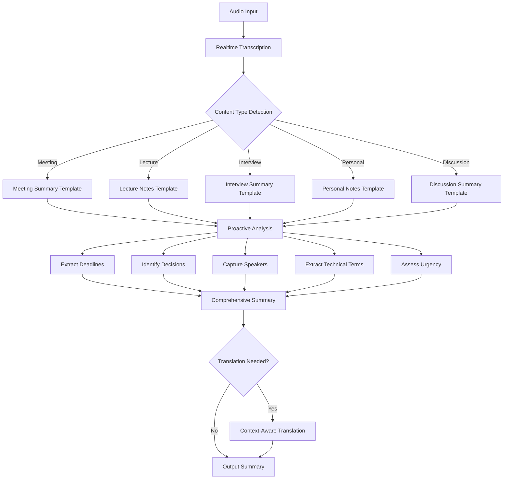

# Prompt Improvements Plan

## Overview

This plan outlines comprehensive improvements to the SoulNotes prompt system to support:
- **Multiple content types** (meetings, lectures, interviews, personal notes, discussions)
- **Proactive elements** (deadlines, decisions, follow-ups, action items)
- **Context capture** (speakers, time references, technical terms, emotional tone)

---

## Current State Analysis

### 1. Summarization Prompt (Current)
**Location:** [`src/lib/constants.ts:201`](src/lib/constants.ts:201)

**Issues:**
- Assumes all content is a "meeting" - inflexible for other content types
- No speaker identification or attribution
- Missing deadline/date extraction
- No decision tracking vs. discussion topics
- No proactive follow-up suggestions
- No technical term extraction
- Rigid format that may not suit all content

### 2. Translation Prompt (Current)
**Location:** [`src/lib/constants.ts:194`](src/lib/constants.ts:194)

**Issues:**
- Purely literal translation - loses context
- No domain/technical term handling
- No speaker attribution preservation
- No idiom or cultural context handling

### 3. Realtime Session Instructions (Current)
**Location:** [`src/lib/constants.ts:289`](src/lib/constants.ts:289)

**Issues:**
- Generic personality settings
- No transcription-specific guidance
- No language detection instructions

---

## Proposed Improvements

### 1. Enhanced Summarization Prompt

#### Content Type Detection
The prompt should auto-detect and adapt to:
- **Meeting** - Multi-party discussion with decisions and action items
- **Lecture/Presentation** - Educational content with key concepts
- **Interview** - Q&A format with interviewer/interviewee
- **Personal Notes** - Single speaker thoughts and reminders
- **Discussion/Debate** - Multiple viewpoints on topics

#### Proactive Elements
```
## PROACTIVE INSIGHTS
### Deadlines & Time References
- [Date/Time] - [What is due]

### Decisions Made
- [Decision] - [Context/Reasoning]

### Open Questions
- [Unresolved question needing follow-up]

### Suggested Follow-ups
- [Proactive next step recommendation]
```

#### Context Capture
```
## CONTEXT
### Speakers Identified
- [Speaker name/role] - [Key contributions]

### Technical Terms & Concepts
- [Term] - [Brief definition from context]

### Tone & Urgency
- Overall tone: [Formal/Casual/Technical/etc.]
- Urgency indicators: [High/Medium/Low]
```

#### Complete New Prompt Structure

```markdown
Analyze the following transcribed content and create a comprehensive summary. First, identify the content type, then structure your response accordingly.

## CONTENT TYPE DETECTION
Determine if this is:
- MEETING: Multi-party discussion with decisions/action items
- LECTURE: Educational presentation with concepts to learn
- INTERVIEW: Q&A format between parties
- PERSONAL: Single speaker notes, thoughts, or reminders
- DISCUSSION: Multiple viewpoints on topics without formal decisions

## OUTPUT FORMAT

# [Appropriate Title Based on Content]

## CONTENT TYPE: [Detected Type]

## EXECUTIVE SUMMARY
[2-3 sentence overview of the main purpose and outcome]

## KEY INFORMATION

### Main Topics Covered
- [Topic with brief context]

### Important Points
- [Key point with attribution if identifiable]

## ACTION ITEMS & COMMITMENTS
- [ ] [Action item] - [Owner if identifiable] - [Due date if mentioned]
- [ ] [Action item] - [Owner if identifiable] - [Due date if mentioned]

## DECISIONS MADE
- **Decision**: [What was decided]
  - **Context**: [Why this decision was made]
  - **Impact**: [Who/what is affected]

## DEADLINES & TIME REFERENCES
| When | What | Context |
|------|------|---------|
| [Date/Time] | [Event/Deadline] | [Additional context] |

## SPEAKERS & CONTRIBUTIONS
[If multiple speakers identified]
- **[Speaker identifier]**: [Key points they made]

## TECHNICAL TERMS & CONCEPTS
- **[Term]**: [Definition or context from content]

## OPEN QUESTIONS & FOLLOW-UPS
- [ ] [Unresolved question requiring follow-up]
- [ ] [Topic that needs further discussion]

## PROACTIVE RECOMMENDATIONS
Based on the content, consider:
1. [Suggested next step]
2. [Related topic to explore]
3. [Potential risk or opportunity to address]

## TONE & URGENCY
- **Overall Tone**: [Formal/Casual/Technical/Collaborative/etc.]
- **Urgency Level**: [High/Medium/Low] - [Reasoning]
- **Emotional Indicators**: [Any notable emotional context]

---

## RULES:
1. Adapt sections based on content type - omit irrelevant sections
2. Extract ALL dates, times, and deadlines mentioned
3. Preserve speaker attribution when identifiable
4. Capture technical terms with their contextual meaning
5. Be proactive - suggest follow-ups and highlight risks
6. Use concrete, specific language - avoid vague statements
7. If information is unclear, note it rather than guessing
8. Maintain chronological order for events/deadlines
9. Format action items as checkboxes for usability
10. Output ONLY the summary - no meta-commentary

## CONTENT TO ANALYZE:
{text}
```

---

### 2. Enhanced Translation Prompt

#### Improvements
- Context-aware translation
- Technical term preservation
- Speaker attribution maintenance
- Idiom handling
- Tone preservation

#### New Translation Prompt

```markdown
You are a professional translator. Translate the following text from {source_language} to {target_language}.

## TRANSLATION GUIDELINES

### Accuracy
- Translate meaning and intent, not just words
- Preserve the original tone (formal, casual, technical, etc.)
- Maintain speaker attribution if present (e.g., "John:", "Speaker 1:")

### Technical Terms
- Keep domain-specific technical terms in their original form if commonly used
- Provide brief context in parentheses for unfamiliar terms: "term (context)"
- Preserve acronyms unless there's a well-known translation

### Structure
- Maintain original paragraph breaks and formatting
- Preserve bullet points, numbering, and indentation
- Keep timestamps or time references in original format

### Idioms & Cultural Context
- Translate idioms to their closest equivalent in the target language
- If no equivalent exists, provide a literal translation with context
- Preserve cultural references with brief explanation if needed

### Output Format
- Output ONLY the translated text
- Use clear paragraph breaks with blank lines between paragraphs
- Do not add explanations, notes, or commentary

## TEXT TO TRANSLATE:
{text}
```

---

### 3. Enhanced Realtime Session Instructions

#### Improvements
- Transcription-specific guidance
- Language detection and handling
- Context awareness for better transcription

#### New Realtime Session Instructions

```markdown
You are an AI transcription assistant. Your role is to accurately capture and transcribe spoken content.

## TRANSCRIPTION GUIDELINES

### Accuracy First
- Capture exactly what is said, including fillers, repetitions, and corrections
- Preserve speaker turns and dialogue flow
- Note non-verbal cues when relevant: [laughter], [pause], [overlap]

### Language Handling
- Auto-detect the primary language being spoken
- Maintain the original language - do not translate unless explicitly requested
- Handle code-switching (language mixing) naturally
- Preserve dialect and accent characteristics in writing style

### Speaker Identification
- Differentiate between speakers when possible: Speaker 1, Speaker 2, etc.
- Note speaker changes with line breaks or labels
- If speakers identify themselves, use their names

### Technical Content
- Preserve technical terms, product names, and proper nouns exactly
- Capture numbers, dates, and measurements accurately
- Note uncertainty with [?] for unclear words

### Formatting
- Use natural paragraph breaks for topic changes
- Preserve the flow and rhythm of speech
- Include timestamps if available in the format [HH:MM:SS]

### Context Awareness
- Learn and remember names, terms, and acronyms introduced early in the session
- Maintain consistency with terminology throughout
- Adapt to the domain (medical, legal, technical, casual) as appropriate

## PERSONALITY
- Be accurate and thorough in transcription
- Do not summarize or interpret during active transcription
- Wait for explicit requests to summarize or translate
- Your knowledge cutoff is 2023-10
```

---

## Implementation Plan

### Phase 1: Update Constants
1. Replace [`DEFAULT_SUMMARIZE_PROMPT`](src/lib/constants.ts:201) with enhanced version
2. Replace [`DEFAULT_TRANSLATE_PROMPT`](src/lib/constants.ts:194) with enhanced version
3. Replace [`REALTIME_SESSION_INSTRUCTIONS`](src/lib/constants.ts:289) with enhanced version

### Phase 2: Update Configuration
1. Update [`config.example.yml`](config.example.yml) with new default prompts
2. Ensure backward compatibility with existing user configs

### Phase 3: Documentation
1. Add prompt customization guide to README
2. Document available placeholders and their usage
3. Provide examples for different content types

---

## Mermaid Diagram: Prompt Flow



---

## Placeholders Reference

### Summarization Prompt
| Placeholder | Description | Example |
|-------------|-------------|---------|
| `{text}` | The transcribed text to summarize | Full transcription content |

### Translation Prompt
| Placeholder | Description | Example |
|-------------|-------------|---------|
| `{source_language}` | Source language name | Chinese, English, Spanish |
| `{target_language}` | Target language name | English, French, Japanese |
| `{text}` | The text to translate | Content to be translated |

---

## Testing Considerations

1. **Content Type Detection**: Test with various input types to verify correct detection
2. **Deadline Extraction**: Verify date/time parsing in different formats
3. **Speaker Attribution**: Test with single and multi-speaker content
4. **Technical Terms**: Verify preservation and context capture
5. **Translation Quality**: Test with idioms, technical content, and mixed languages

---

## Backward Compatibility

- Existing user configs with custom prompts will continue to work
- New default prompts only apply when no custom prompt is set
- Users can opt into new features by updating their config