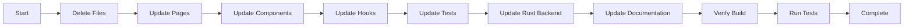

# Remove Premium Paywall Plan

## Overview

SoulNotes is transitioning from a premium paid model to a fully open-source and free application. This plan outlines all changes needed to remove the license validation system and premium feature restrictions.

## Current Implementation Summary

### Premium Features Currently Locked

| Feature | Page/Component | Current Access |
|---------|----------------|----------------|
| AI Conversation Partner | `/conversation` | Premium only (PremiumGate) |
| Progress Dashboard | `/dashboard` | Premium only (PremiumGate) |
| Unlimited Vocabulary | Flashcards page | Free tier limited to 25 words/deck |

### License System Components

```mermaid
flowchart TD
    subgraph Frontend [Frontend Components]
        A[LicenseContext.tsx] --> B[useLicense hook]
        B --> C[PremiumGate.tsx]
        B --> D[LicenseModal.tsx]
        B --> E[AppHeader.tsx]
        C --> F[/conversation page]
        C --> G[/dashboard page]
        E --> H[ModeTab - lock icons]
    end
    
    subgraph LicenseLogic [License Logic]
        I[license.ts] --> J[localStorage]
        I --> K[WASM Module]
        I --> L[Tauri Commands]
    end
    
    subgraph Backend [Rust Backend]
        M[license.rs] --> N[Ed25519 Validation]
        O[public_key.bin] --> N
    end
    
    subgraph Tools [Keygen Tool]
        P[keygen tool] --> Q[Generate Keys]
    end
    
    B --> I
    K --> M
    L --> M
```

## Files to Modify or Delete

### Delete Entire Files

| File | Reason |
|------|--------|
| `src/components/PremiumGate.tsx` | Premium gate wrapper - no longer needed |
| `src/components/LicenseModal.tsx` | License entry modal - no longer needed |
| `src/contexts/LicenseContext.tsx` | License state context - no longer needed |
| `src/hooks/useLicense.ts` | License hook - no longer needed |
| `src/lib/license.ts` | License bridge logic - no longer needed |
| `src/types/soulnotes-wasm.d.ts` | WASM type definitions - no longer needed |
| `src-tauri/src/license.rs` | Rust license validation - no longer needed |
| `src-tauri/public_key.bin` | Public key file - no longer needed |
| `src-wasm/` (entire directory) | WASM license module - no longer needed |
| `tools/keygen/` (entire directory) | Keygen tool - no longer needed |

### Modify Files

| File | Changes |
|------|---------|
| `src/app/conversation/page.tsx` | Remove PremiumGate wrapper |
| `src/app/dashboard/page.tsx` | Remove PremiumGate wrapper |
| `src/app/flashcards/page.tsx` | Remove isPremium usage and limits |
| `src/components/AppHeader.tsx` | Remove license button, premium badges, unlock all tabs |
| `src/components/ModeTab.tsx` | Remove isPremium/isUnlocked props |
| `src/components/VocabularyPanel.tsx` | Remove isPremium prop and limit warnings |
| `src/hooks/useVocabulary.ts` | Remove FREE_TIER_LIMITS and isPremium checks |
| `src/hooks/useVocabularySelection.ts` | Remove isPremium limit checks |
| `src-tauri/src/lib.rs` | Remove license command exports |
| `src-tauri/Cargo.toml` | Remove ed25519-dalek dependency |
| `src/app/layout.tsx` | Remove LicenseProvider wrapper |
| `.env.example` | Remove NEXT_PUBLIC_DEV_PREMIUM_BYPASS |

### Update Tests

| File | Changes |
|------|---------|
| `src/components/__tests__/AppHeader.test.tsx` | Remove license mocking |
| `src/components/__tests__/ModeTab.test.tsx` | Remove premium-related tests |
| `src/components/__tests__/VocabularyPanel.test.tsx` | Remove isPremium prop from tests |
| `src/hooks/__tests__/useVocabulary.test.ts` | Remove license mocking |
| `src/hooks/__tests__/useVocabularySelection.test.ts` | Remove license mocking |
| `src/lib/__tests__/license.test.ts` | Delete entire file |

## Detailed Implementation Steps

### Step 1: Remove PremiumGate from Pages

Remove the PremiumGate wrapper from conversation and dashboard pages:

```tsx
// Before
export default function ConversationPage() {
  return (
    <PremiumGate>
      <div>...</div>
    </PremiumGate>
  );
}

// After
export default function ConversationPage() {
  return (
    <div>...</div>
  );
}
```

Files to update:
- `src/app/conversation/page.tsx`
- `src/app/dashboard/page.tsx`

### Step 2: Update AppHeader Component

Remove all license-related UI:

1. Remove `useLicense` import and hook call
2. Remove `LicenseModal` import and component
3. Remove `isPremium` state and checks
4. Remove "Upgrade" button for non-premium users
5. Remove premium badge display
6. Remove lock icons from ModeTab
7. Update MODES array to remove `premium` property

```tsx
// Before
const MODES = [
  { id: 'transcribe', label: 'Transcribe', icon: '🎤', premium: false, path: '/' },
  { id: 'conversation', label: 'Conversation', icon: '💬', premium: true, path: '/conversation' },
  { id: 'flashcards', label: 'Flashcards', icon: '📚', premium: false, path: '/flashcards' },
  { id: 'dashboard', label: 'Dashboard', icon: '📊', premium: true, path: '/dashboard' },
];

// After
const MODES = [
  { id: 'transcribe', label: 'Transcribe', icon: '🎤', path: '/' },
  { id: 'conversation', label: 'Conversation', icon: '💬', path: '/conversation' },
  { id: 'flashcards', label: 'Flashcards', icon: '📚', path: '/flashcards' },
  { id: 'dashboard', label: 'Dashboard', icon: '📊', path: '/dashboard' },
];
```

### Step 3: Update ModeTab Component

Simplify the component to remove premium-related props:

```tsx
// Before
interface ModeTabProps {
  label: string;
  icon: string;
  isActive: boolean;
  isPremium: boolean;
  isUnlocked: boolean;
  onClick: () => void;
}

// After
interface ModeTabProps {
  label: string;
  icon: string;
  isActive: boolean;
  onClick: () => void;
}
```

### Step 4: Remove Vocabulary Limits

Update `useVocabulary.ts` to remove free tier limits:

```tsx
// Remove this constant
const FREE_TIER_LIMITS = {
  maxWordsPerDeck: 25,
};

// Remove isPremium from hook
export function useVocabulary(): UseVocabularyReturn {
  // Remove: const { isPremium } = useLicense();
  // Remove: const isAtLimit = !isPremium && items.length >= FREE_TIER_LIMITS.maxWordsPerDeck;
  
  // Always return isAtLimit: false
  return {
    // ...
    isAtLimit: false,
  };
}
```

### Step 5: Remove LicenseProvider from Layout

Update `src/app/layout.tsx` to remove the LicenseProvider wrapper:

```tsx
// Before
import { LicenseProvider } from '@/hooks/useLicense';

export default function RootLayout({ children }) {
  return (
    <LicenseProvider>
      {children}
    </LicenseProvider>
  );
}

// After
// Remove LicenseProvider import and wrapper
export default function RootLayout({ children }) {
  return children;
}
```

### Step 6: Clean Up Rust Backend

Update `src-tauri/src/lib.rs` to remove license commands:

```rust
// Remove these lines
mod license;

#[tauri::command]
fn activate_license(key: String) -> Result<License, String> {
    license::validate_license(&key).map_err(|e| e.message)
}

#[tauri::command]
fn check_premium() -> bool {
    // Always return true now
    true
}
```

Update `src-tauri/Cargo.toml` to remove ed25519-dalek dependency:

```toml
# Remove this line
ed25519-dalek = { version = "2.1", features = ["rand_core"] }
```

### Step 7: Delete WASM Module

The entire `src-wasm/` directory can be deleted. This includes:
- `src-wasm/Cargo.toml`
- `src-wasm/src/lib.rs`
- Any build artifacts

### Step 8: Delete Keygen Tool

The entire `tools/keygen/` directory can be deleted:
- `tools/keygen/Cargo.toml`
- `tools/keygen/README.md`
- `tools/keygen/src/` (if exists)

### Step 9: Update Tests

Remove license mocking from all test files:

```tsx
// Remove from test files
vi.mock('@/hooks/useLicense', () => ({
  useLicense: () => ({
    isPremium: true, // or remove entirely
    license: null,
    isLoading: false,
    // ...
  }),
}));
```

Update component tests to remove premium-related props:

```tsx
// Before
<ModeTab
  label="Conversation"
  icon="💬"
  isActive={false}
  isPremium={true}
  isUnlocked={true}
  onClick={onClick}
/>

// After
<ModeTab
  label="Conversation"
  icon="💬"
  isActive={false}
  onClick={onClick}
/>
```

### Step 10: Update Documentation

Update `README.md` to:
- Remove premium tier mentions
- Remove license key instructions
- Add open-source license information (MIT or chosen license)
- Update feature list to show all features as free

Update or delete `plans/premium-features.md`:
- Either delete the file entirely
- Or update it to reflect that all features are now free

### Step 11: Environment Variables

Remove from `.env.example`:
```
# Remove this line
NEXT_PUBLIC_DEV_PREMIUM_BYPASS=true
```

## Migration Checklist



## Files Summary

### Files to Delete (12 files/directories)

1. `src/components/PremiumGate.tsx`
2. `src/components/LicenseModal.tsx`
3. `src/contexts/LicenseContext.tsx`
4. `src/hooks/useLicense.ts`
5. `src/lib/license.ts`
6. `src/types/soulnotes-wasm.d.ts`
7. `src/lib/__tests__/license.test.ts`
8. `src-tauri/src/license.rs`
9. `src-tauri/public_key.bin`
10. `src-wasm/` (entire directory)
11. `tools/keygen/` (entire directory)
12. `plans/premium-features.md` (optional)

### Files to Modify (15+ files)

1. `src/app/conversation/page.tsx` - Remove PremiumGate
2. `src/app/dashboard/page.tsx` - Remove PremiumGate
3. `src/app/flashcards/page.tsx` - Remove isPremium usage
4. `src/app/layout.tsx` - Remove LicenseProvider
5. `src/components/AppHeader.tsx` - Remove license UI
6. `src/components/ModeTab.tsx` - Simplify props
7. `src/components/VocabularyPanel.tsx` - Remove isPremium prop
8. `src/hooks/useVocabulary.ts` - Remove limits
9. `src/hooks/useVocabularySelection.ts` - Remove limit checks
10. `src-tauri/src/lib.rs` - Remove license commands
11. `src-tauri/Cargo.toml` - Remove ed25519 dependency
12. `src/components/__tests__/AppHeader.test.tsx` - Update tests
13. `src/components/__tests__/ModeTab.test.tsx` - Update tests
14. `src/components/__tests__/VocabularyPanel.test.tsx` - Update tests
15. `src/hooks/__tests__/useVocabulary.test.ts` - Update tests
16. `src/hooks/__tests__/useVocabularySelection.test.ts` - Update tests
17. `.env.example` - Remove dev bypass variable
18. `README.md` - Update documentation

## Testing Strategy

After making all changes:

1. **Build Test**: Ensure the project builds without errors
   ```bash
   npm run build
   npm run tauri build
   ```

2. **Unit Tests**: Run all tests
   ```bash
   npm run test
   cargo test --manifest-path src-tauri/Cargo.toml
   ```

3. **Manual Testing**:
   - Verify all pages are accessible without license
   - Verify vocabulary has no limits
   - Verify no license-related UI elements remain
   - Verify no console errors related to license

4. **Clean Install Test**:
   - Clear localStorage
   - Fresh install of the app
   - Verify all features work without license

## Notes

- This is a breaking change for the licensing system - all existing license keys will become invalid
- Users who previously purchased licenses should be informed of the transition
- Consider adding a note in README about the project becoming open source
- The `NEXT_PUBLIC_DEV_PREMIUM_BYPASS` environment variable is no longer needed

## Post-Implementation

After completing the changes:

1. Update the README to reflect the open-source status
2. Add a LICENSE file (MIT recommended)
3. Update any marketing materials or documentation
4. Consider a blog post or announcement about the transition