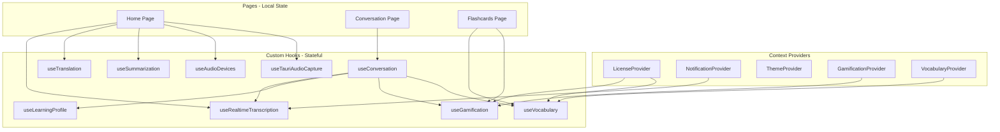
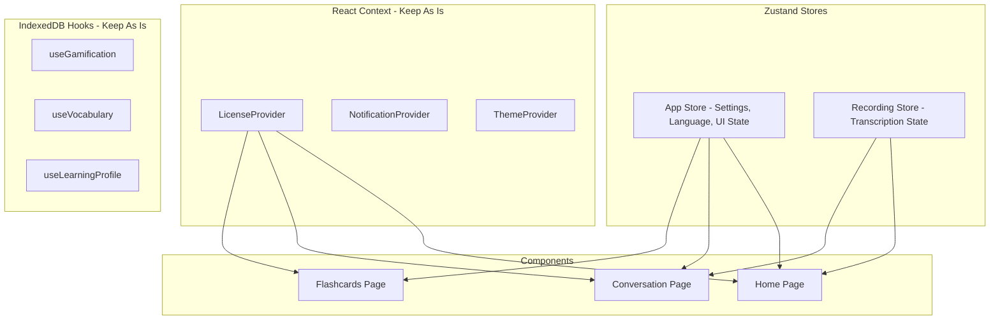

# State Management Improvement Plan

**Decision: Zustand with Wrapper Pattern for Future-Proofing**

**Status: ✅ COMPLETED** (March 2026)

---

## Key Design Decisions

| Decision | Rationale |
|----------|-----------|
| **No language persistence** | Meetings and learning can use different languages - start fresh each session |
| **Separate recording stores per page** | Transcription and Conversation are independent modes |
| **DevTools enabled** | Redux DevTools integration for better debugging |
| **Integration tests first** | TDD approach - write tests before implementation |
| **Incremental migration** | Migrate one store at a time, test each step |

---

## Implementation Plan

### Phase 1: Setup and Infrastructure

#### 1.1 Install Dependencies
```bash
npm install zustand
```

#### 1.2 Create Store Directory Structure
```
src/
├── stores/
│   ├── index.ts              # Export all stores
│   ├── appStore.ts           # App-wide settings (NO persistence for language)
│   ├── transcribeStore.ts    # Transcription page state (separate from conversation)
│   ├── conversationStore.ts  # Conversation page state (separate from transcription)
│   ├── middleware/
│   │   └── devtools.ts       # Redux DevTools integration
│   └── types.ts              # Shared store types
```

#### 1.3 Create Base Types
```typescript
// src/stores/types.ts
export type ChineseVariant = 'simplified' | 'traditional';

export interface RealtimeConfig {
  baseUrl: string;
  transcribeModel: string;
  defaultLanguage: string;
}

export interface TranscriptMessage {
  id: string;
  text: string;
  timestamp: Date;
}

export type CaptureMode = 'mic' | 'system' | 'both';
export type ActivePanel = 'translation' | 'summary';
```

---

### Phase 2: Integration Tests First (TDD)

#### 2.1 Create Integration Test Structure
```
src/
├── stores/
│   └── __tests__/
│       ├── appStore.integration.test.ts
│       ├── transcribeStore.integration.test.ts
│       ├── conversationStore.integration.test.ts
│       └── test-utils.ts
```

#### 2.2 Write App Store Integration Tests
```typescript
// src/stores/__tests__/appStore.integration.test.ts
import { describe, it, expect, beforeEach } from 'vitest';
import { renderHook, act } from '@testing-library/react';
import { useAppState } from '../appStore';

describe('useAppState - Integration Tests', () => {
  beforeEach(() => {
    // Reset to defaults before each test
    const { resetToDefaults } = useAppState();
    act(() => resetToDefaults());
  });

  describe('Language Settings', () => {
    it('should start with default language settings', () => {
      const { sourceLanguage, targetLanguage } = useAppState();
      expect(sourceLanguage).toBe('en');
      expect(targetLanguage).toBe('es');
    });

    it('should NOT persist language settings across sessions', () => {
      const { setSourceLanguage, resetToDefaults } = useAppState();
      
      // Change language
      act(() => setSourceLanguage('fr'));
      expect(useAppState().sourceLanguage).toBe('fr');
      
      // Simulate new session (reset)
      act(() => resetToDefaults());
      
      // Should be back to defaults, not persisted
      expect(useAppState().sourceLanguage).toBe('en');
    });

    it('should handle Chinese variant selection', () => {
      const { setSourceLanguage } = useAppState();
      
      act(() => setSourceLanguage('zh', 'traditional'));
      const state = useAppState();
      
      expect(state.sourceLanguage).toBe('zh');
      expect(state.chineseVariant).toBe('traditional');
    });
  });

  describe('UI State', () => {
    it('should track active panel', () => {
      const { setActivePanel } = useAppState();
      
      act(() => setActivePanel('summary'));
      expect(useAppState().activePanel).toBe('summary');
    });
  });

  describe('Config', () => {
    it('should update realtime config', () => {
      const { updateRealtimeConfig } = useAppState();
      
      act(() => updateRealtimeConfig({ baseUrl: 'https://custom.api' }));
      expect(useAppState().realtimeConfig.baseUrl).toBe('https://custom.api');
    });
  });
});
```

#### 2.3 Write Transcribe Store Integration Tests
```typescript
// src/stores/__tests__/transcribeStore.integration.test.ts
import { describe, it, expect, beforeEach } from 'vitest';
import { renderHook, act } from '@testing-library/react';
import { useTranscribeState } from '../transcribeStore';

describe('useTranscribeState - Integration Tests', () => {
  beforeEach(() => {
    const { reset } = useTranscribeState();
    act(() => reset());
  });

  describe('Recording State', () => {
    it('should track recording state', () => {
      const { setRecording } = useTranscribeState();
      
      act(() => setRecording(true));
      expect(useTranscribeState().isRecording).toBe(true);
    });

    it('should track processing state', () => {
      const { setProcessing } = useTranscribeState();
      
      act(() => setProcessing(true));
      expect(useTranscribeState().isProcessing).toBe(true);
    });
  });

  describe('Audio Devices', () => {
    it('should track capture mode', () => {
      const { setCaptureMode } = useTranscribeState();
      
      act(() => setCaptureMode('system'));
      expect(useTranscribeState().captureMode).toBe('system');
    });

    it('should track selected mic device', () => {
      const { setMicDevice } = useTranscribeState();
      
      act(() => setMicDevice('device-123'));
      expect(useTranscribeState().selectedMicDevice).toBe('device-123');
    });
  });

  describe('Transcript', () => {
    it('should accumulate transcript messages', () => {
      const { addTranscriptMessage } = useTranscribeState();
      
      act(() => addTranscriptMessage({
        id: '1',
        text: 'Hello',
        timestamp: new Date(),
      }));
      
      const state = useTranscribeState();
      expect(state.transcriptMessages).toHaveLength(1);
      expect(state.transcript).toBe('Hello');
    });

    it('should clear transcript', () => {
      const { addTranscriptMessage, clearTranscript } = useTranscribeState();
      
      act(() => addTranscriptMessage({
        id: '1',
        text: 'Hello',
        timestamp: new Date(),
      }));
      
      act(() => clearTranscript());
      
      const state = useTranscribeState();
      expect(state.transcriptMessages).toHaveLength(0);
      expect(state.transcript).toBe('');
    });
  });
});
```

---

### Phase 3: App Store Implementation

#### 3.1 Create App Store with Wrapper Pattern and DevTools
```typescript
// src/stores/appStore.ts
import { create } from 'zustand';
import { devtools } from 'zustand/middleware';
import type { ChineseVariant, RealtimeConfig, ActivePanel } from './types';
import { DEFAULT_REALTIME_CONFIG, DEFAULT_LANGUAGE_SETTINGS } from '@/lib/constants';

interface AppState {
  // Language settings - NOT persisted (meetings/learning can differ)
  sourceLanguage: string;
  chineseVariant: ChineseVariant;
  targetLanguage: string;
  
  // UI state
  activePanel: ActivePanel;
  
  // Config (persisted separately if needed)
  realtimeConfig: RealtimeConfig;
  
  // Actions
  setSourceLanguage: (lang: string, variant?: ChineseVariant) => void;
  setTargetLanguage: (lang: string) => void;
  setActivePanel: (panel: ActivePanel) => void;
  updateRealtimeConfig: (config: Partial<RealtimeConfig>) => void;
  resetToDefaults: () => void;
}

const initialState = {
  sourceLanguage: DEFAULT_LANGUAGE_SETTINGS.realtime,
  chineseVariant: DEFAULT_LANGUAGE_SETTINGS.chineseVariant as ChineseVariant,
  targetLanguage: DEFAULT_LANGUAGE_SETTINGS.target,
  activePanel: 'translation' as ActivePanel,
  realtimeConfig: {
    baseUrl: DEFAULT_REALTIME_CONFIG.baseUrl,
    transcribeModel: DEFAULT_REALTIME_CONFIG.transcribeModel,
    defaultLanguage: DEFAULT_REALTIME_CONFIG.defaultLanguage,
  },
};

// Internal Zustand store - not exported directly
const useAppStoreInternal = create<AppState>()(
  devtools(
    (set) => ({
      ...initialState,
      
      setSourceLanguage: (lang, variant) => set(
        (state) => ({
          sourceLanguage: lang,
          chineseVariant: variant ?? state.chineseVariant,
        }),
        false,
        'setSourceLanguage'
      ),
      
      setTargetLanguage: (lang) => set(
        { targetLanguage: lang },
        false,
        'setTargetLanguage'
      ),
      
      setActivePanel: (panel) => set(
        { activePanel: panel },
        false,
        'setActivePanel'
      ),
      
      updateRealtimeConfig: (config) => set(
        (state) => ({
          realtimeConfig: { ...state.realtimeConfig, ...config },
        }),
        false,
        'updateRealtimeConfig'
      ),
      
      resetToDefaults: () => set(
        initialState,
        false,
        'resetToDefaults'
      ),
    }),
    { name: 'SoulNotes-App' }
  )
);

// ============================================
// PUBLIC API - Wrapper Hook for Future-Proofing
// ============================================
// This hook wraps the Zustand store. If we ever migrate to Redux,
// only this file needs to change - components stay the same.

export function useAppState() {
  const store = useAppStoreInternal();
  
  return {
    // State
    sourceLanguage: store.sourceLanguage,
    chineseVariant: store.chineseVariant,
    targetLanguage: store.targetLanguage,
    activePanel: store.activePanel,
    realtimeConfig: store.realtimeConfig,
    
    // Actions
    setSourceLanguage: store.setSourceLanguage,
    setTargetLanguage: store.setTargetLanguage,
    setActivePanel: store.setActivePanel,
    updateRealtimeConfig: store.updateRealtimeConfig,
    resetToDefaults: store.resetToDefaults,
  };
}

// Selector hooks for performance optimization
export const useSourceLanguage = () => useAppStoreInternal((s) => s.sourceLanguage);
export const useTargetLanguage = () => useAppStoreInternal((s) => s.targetLanguage);
export const useActivePanel = () => useAppStoreInternal((s) => s.activePanel);
```

---

### Phase 4: Transcribe Store Implementation

#### 4.1 Create Transcribe Store (Separate from Conversation)
```typescript
// src/stores/transcribeStore.ts
import { create } from 'zustand';
import { devtools } from 'zustand/middleware';
import type { CaptureMode, TranscriptMessage } from './types';

interface TranscribeState {
  // Recording state - local to transcription page
  isRecording: boolean;
  isProcessing: boolean;
  
  // Audio devices (desktop only)
  captureMode: CaptureMode;
  selectedMicDevice: string | null;
  selectedSystemDevice: string | null;
  
  // Transcription results
  transcript: string;
  transcriptMessages: TranscriptMessage[];
  
  // Actions
  setRecording: (recording: boolean) => void;
  setProcessing: (processing: boolean) => void;
  setCaptureMode: (mode: CaptureMode) => void;
  setMicDevice: (id: string | null) => void;
  setSystemDevice: (id: string | null) => void;
  setTranscript: (text: string) => void;
  addTranscriptMessage: (message: TranscriptMessage) => void;
  clearTranscript: () => void;
  reset: () => void;
}

const initialState = {
  isRecording: false,
  isProcessing: false,
  captureMode: 'mic' as CaptureMode,
  selectedMicDevice: null,
  selectedSystemDevice: null,
  transcript: '',
  transcriptMessages: [] as TranscriptMessage[],
};

// Internal Zustand store - not exported
const useTranscribeStoreInternal = create<TranscribeState>()(
  devtools(
    (set) => ({
      ...initialState,
      
      setRecording: (recording) => set(
        { isRecording: recording },
        false,
        'setRecording'
      ),
      
      setProcessing: (processing) => set(
        { isProcessing: processing },
        false,
        'setProcessing'
      ),
      
      setCaptureMode: (mode) => set(
        { captureMode: mode },
        false,
        'setCaptureMode'
      ),
      
      setMicDevice: (id) => set(
        { selectedMicDevice: id },
        false,
        'setMicDevice'
      ),
      
      setSystemDevice: (id) => set(
        { selectedSystemDevice: id },
        false,
        'setSystemDevice'
      ),
      
      setTranscript: (text) => set(
        { transcript: text },
        false,
        'setTranscript'
      ),
      
      addTranscriptMessage: (message) => set(
        (state) => ({
          transcriptMessages: [...state.transcriptMessages, message],
          transcript: state.transcript ? `${state.transcript} ${message.text}` : message.text,
        }),
        false,
        'addTranscriptMessage'
      ),
      
      clearTranscript: () => set(
        { transcript: '', transcriptMessages: [] },
        false,
        'clearTranscript'
      ),
      
      reset: () => set(
        initialState,
        false,
        'reset'
      ),
    }),
    { name: 'SoulNotes-Transcribe' }
  )
);

// ============================================
// PUBLIC API - Wrapper Hook for Future-Proofing
// ============================================

export function useTranscribeState() {
  const store = useTranscribeStoreInternal();
  
  return {
    // State
    isRecording: store.isRecording,
    isProcessing: store.isProcessing,
    captureMode: store.captureMode,
    selectedMicDevice: store.selectedMicDevice,
    selectedSystemDevice: store.selectedSystemDevice,
    transcript: store.transcript,
    transcriptMessages: store.transcriptMessages,
    
    // Actions
    setRecording: store.setRecording,
    setProcessing: store.setProcessing,
    setCaptureMode: store.setCaptureMode,
    setMicDevice: store.setMicDevice,
    setSystemDevice: store.setSystemDevice,
    setTranscript: store.setTranscript,
    addTranscriptMessage: store.addTranscriptMessage,
    clearTranscript: store.clearTranscript,
    reset: store.reset,
  };
}

// Selector hooks for performance optimization
export const useIsRecording = () => useTranscribeStoreInternal((s) => s.isRecording);
export const useTranscript = () => useTranscribeStoreInternal((s) => s.transcript);
```

---

### Phase 5: Conversation Store Implementation

#### 5.1 Create Conversation Store (Separate from Transcribe)
```typescript
// src/stores/conversationStore.ts
import { create } from 'zustand';
import { devtools } from 'zustand/middleware';
import type { ConversationScenario, DifficultyLevel } from '@/types/conversation';

interface ConversationState {
  // Session state - local to conversation page
  isRecording: boolean;
  isProcessing: boolean;
  isSpeaking: boolean;
  
  // Session config
  language: string;
  scenario: ConversationScenario | null;
  difficulty: DifficultyLevel;
  
  // Actions
  setRecording: (recording: boolean) => void;
  setProcessing: (processing: boolean) => void;
  setSpeaking: (speaking: boolean) => void;
  setLanguage: (language: string) => void;
  setScenario: (scenario: ConversationScenario | null) => void;
  setDifficulty: (difficulty: DifficultyLevel) => void;
  reset: () => void;
}

const initialState = {
  isRecording: false,
  isProcessing: false,
  isSpeaking: false,
  language: 'en',
  scenario: null,
  difficulty: 'intermediate' as DifficultyLevel,
};

const useConversationStoreInternal = create<ConversationState>()(
  devtools(
    (set) => ({
      ...initialState,
      
      setRecording: (recording) => set({ isRecording: recording }, false, 'setRecording'),
      setProcessing: (processing) => set({ isProcessing: processing }, false, 'setProcessing'),
      setSpeaking: (speaking) => set({ isSpeaking: speaking }, false, 'setSpeaking'),
      setLanguage: (language) => set({ language }, false, 'setLanguage'),
      setScenario: (scenario) => set({ scenario }, false, 'setScenario'),
      setDifficulty: (difficulty) => set({ difficulty }, false, 'setDifficulty'),
      reset: () => set(initialState, false, 'reset'),
    }),
    { name: 'SoulNotes-Conversation' }
  )
);

// PUBLIC API - Wrapper Hook
export function useConversationState() {
  const store = useConversationStoreInternal();
  
  return {
    isRecording: store.isRecording,
    isProcessing: store.isProcessing,
    isSpeaking: store.isSpeaking,
    language: store.language,
    scenario: store.scenario,
    difficulty: store.difficulty,
    
    setRecording: store.setRecording,
    setProcessing: store.setProcessing,
    setSpeaking: store.setSpeaking,
    setLanguage: store.setLanguage,
    setScenario: store.setScenario,
    setDifficulty: store.setDifficulty,
    reset: store.reset,
  };
}
```

---

### Phase 6: Component Refactoring

#### 6.1 Update CapturePanel to Use Stores
```typescript
// src/components/CapturePanel.tsx - AFTER REFACTOR
// Props reduced from 17 to ~5

import { useAppState } from '@/stores/appStore';
import { useTranscribeState } from '@/stores/transcribeStore';
import { AudioDeviceSelector } from './AudioDeviceSelector';
import { useAudioDevices } from '@/hooks/useAudioDevices';

interface CapturePanelProps {
  isDesktop: boolean;
  onStartRecording: () => void;
  onStopRecording: () => void;
}

export function CapturePanel({
  isDesktop,
  onStartRecording,
  onStopRecording,
}: CapturePanelProps) {
  // Get state from stores
  const { sourceLanguage, chineseVariant, setSourceLanguage } = useAppState();
  const {
    isRecording,
    isProcessing,
    captureMode,
    setCaptureMode,
    setMicDevice,
    setSystemDevice
  } = useTranscribeState();
  
  // Audio devices still from hook (desktop-specific)
  const { micDevices, systemDevices, selectedMicDevice, selectedSystemDevice } = useAudioDevices();
  
  // ... rest of component
}
```

#### 6.2 Update Home Page to Use Stores
```typescript
// src/app/page.tsx - AFTER REFACTOR
// State variables reduced from 10+ to ~2

import { useAppState } from '@/stores/appStore';
import { useTranscribeState } from '@/stores/transcribeStore';
import { useRealtimeTranscription } from '@/hooks/useRealtimeTranscription';
// ... other imports

export default function Home() {
  const isDesktop = isDesktopMode();
  
  // App state from store (language NOT persisted)
  const {
    sourceLanguage,
    chineseVariant,
    targetLanguage,
    activePanel,
    realtimeConfig,
    setSourceLanguage,
    setTargetLanguage,
    setActivePanel,
  } = useAppState();
  
  // Transcribe state from store (separate from conversation)
  const {
    isRecording,
    isProcessing,
    captureMode,
    selectedMicDevice,
    selectedSystemDevice,
    setRecording,
    setProcessing,
    setCaptureMode,
    setMicDevice,
    setSystemDevice,
    transcript,
    transcriptMessages,
    clearTranscript,
  } = useTranscribeState();
  
  // Hooks for complex async logic
  const { startTranscription, stopTranscription, sendAudioData } = useRealtimeTranscription({
    baseUrl: realtimeConfig.baseUrl,
    model: realtimeConfig.transcribeModel,
    language: sourceLanguage,
    useExternalAudio: isDesktop,
  });
  
  // ... rest of component with much less local state
}
```

---

### Phase 7: Migration Checklist

#### Step-by-Step Migration (Incremental)

1. **Install Zustand**
   - [ ] Run `npm install zustand`
   - [ ] Verify installation

2. **Create Store Infrastructure**
   - [ ] Create `src/stores/` directory
   - [ ] Create `src/stores/types.ts`
   - [ ] Create `src/stores/index.ts`

3. **Write Integration Tests First (TDD)**
   - [ ] Create `src/stores/__tests__/` directory
   - [ ] Create `src/stores/__tests__/test-utils.ts`
   - [ ] Write `appStore.integration.test.ts`
   - [ ] Write `transcribeStore.integration.test.ts`
   - [ ] Run tests (should fail - stores don't exist yet)

4. **Implement App Store**
   - [ ] Create `src/stores/appStore.ts`
   - [ ] Add language state (NO persistence)
   - [ ] Add UI state
   - [ ] Add DevTools middleware
   - [ ] Export wrapper hook
   - [ ] Run tests (should pass)

5. **Implement Transcribe Store**
   - [ ] Create `src/stores/transcribeStore.ts`
   - [ ] Add recording state
   - [ ] Add device state
   - [ ] Add transcript state
   - [ ] Add DevTools middleware
   - [ ] Export wrapper hook
   - [ ] Run tests (should pass)

6. **Implement Conversation Store**
   - [ ] Create `src/stores/conversationStore.ts`
   - [ ] Add session state
   - [ ] Add DevTools middleware
   - [ ] Export wrapper hook
   - [ ] Run tests (should pass)

7. **Refactor Components (One at a Time)**
   - [ ] Update `CapturePanel.tsx` to use stores
   - [ ] Run tests
   - [ ] Update `OutputPanel.tsx` to use stores
   - [ ] Run tests
   - [ ] Update `TranscriptPanel.tsx` to use stores
   - [ ] Run tests
   - [ ] Update `page.tsx` to use stores
   - [ ] Run tests

8. **Cleanup**
   - [ ] Remove unused local state
   - [ ] Remove prop drilling
   - [ ] Update documentation

---

## File Changes Summary

### New Files
| File | Purpose |
|------|---------|
| `src/stores/index.ts` | Export all stores |
| `src/stores/types.ts` | Shared types |
| `src/stores/appStore.ts` | App settings store (no language persistence) |
| `src/stores/transcribeStore.ts` | Transcription page state |
| `src/stores/conversationStore.ts` | Conversation page state |
| `src/stores/__tests__/test-utils.ts` | Test utilities |
| `src/stores/__tests__/appStore.integration.test.ts` | Integration tests |
| `src/stores/__tests__/transcribeStore.integration.test.ts` | Integration tests |
| `src/stores/__tests__/conversationStore.integration.test.ts` | Integration tests |

### Modified Files
| File | Changes |
|------|---------|
| `package.json` | Add zustand dependency |
| `src/app/page.tsx` | Use stores instead of local state |
| `src/app/conversation/page.tsx` | Use conversation store |
| `src/components/CapturePanel.tsx` | Use stores, reduce props |
| `src/components/OutputPanel.tsx` | Use stores |
| `src/components/TranscriptPanel.tsx` | Use stores |

### Unchanged Files
| File | Reason |
|------|--------|
| `src/contexts/LicenseContext.tsx` | Already well-structured |
| `src/contexts/NotificationContext.tsx` | Already well-structured |
| `src/hooks/useTheme.tsx` | Already well-structured |
| `src/hooks/useGamification.ts` | Complex IndexedDB logic |
| `src/hooks/useVocabulary.ts` | Complex IndexedDB logic |
| `src/hooks/useLearningProfile.ts` | Complex IndexedDB logic |

---

## Expected Results

| Metric | Before | After |
|--------|--------|-------|
| Props in CapturePanel | 17 | ~5 |
| State variables in page.tsx | 10+ | ~2 |
| Prop drilling levels | 2-3 | 0 |
| Bundle size increase | - | ~1KB |
| Store files | 0 | 5 |
| Integration test files | 0 | 4 |
| DevTools support | No | Yes |

---

## Current Architecture Analysis

### State Distribution Map



### Current State Locations

| State | Location | Type |
|-------|----------|------|
| License/Premium | [`LicenseContext.tsx`](src/contexts/LicenseContext.tsx) | Context |
| Notifications | [`NotificationContext.tsx`](src/contexts/NotificationContext.tsx) | Context |
| Theme | [`useTheme.tsx`](src/hooks/useTheme.tsx) | Context |
| User Progress/XP | [`useGamification.ts`](src/hooks/useGamification.ts) | Hook + IndexedDB |
| Vocabulary/Decks | [`useVocabulary.ts`](src/hooks/useVocabulary.ts) | Hook + IndexedDB |
| Conversation Session | [`useConversation.ts`](src/hooks/useConversation.ts) | Hook |
| Learning Profile | [`useLearningProfile.ts`](src/hooks/useLearningProfile.ts) | Hook + IndexedDB |
| Transcription | [`useRealtimeTranscription.ts`](src/hooks/useRealtimeTranscription.ts) | Hook |
| Translation | [`useTranslation.ts`](src/hooks/useTranslation.ts) | Hook |
| Audio Devices | [`useAudioDevices.ts`](src/hooks/useAudioDevices.ts) | Hook |
| Language Settings | [`page.tsx`](src/app/page.tsx) | Local State |
| Recording State | [`page.tsx`](src/app/page.tsx) | Local State |
| Active Panel | [`page.tsx`](src/app/page.tsx) | Local State |

### Identified Issues

1. **Prop Drilling in Home Page**
   - [`CapturePanel`](src/components/CapturePanel.tsx) receives 17 props from [`page.tsx`](src/app/page.tsx)
   - Many props are passed through multiple levels

2. **Duplicated/Scattered State**
   - Language settings exist in multiple hooks and pages
   - Recording state managed independently in multiple places

3. **Complex Page Components**
   - [`page.tsx`](src/app/page.tsx) manages 10+ state variables
   - Multiple useEffect hooks for coordination

4. **Cross-Cutting Concerns**
   - Recording state affects transcription, translation, and summarization
   - Language changes affect multiple subsystems

5. **No Centralized App State**
   - Each page manages its own configuration
   - Settings not persisted across sessions

---

## Improvement Options

### Option 1: Redux Toolkit

**Pros:**
- Single source of truth
- Excellent DevTools for debugging
- Powerful middleware ecosystem
- Predictable state updates
- Good for complex state interactions

**Cons:**
- Additional boilerplate
- Learning curve for team
- May be overkill for this app size
- Another dependency (~10KB gzipped)

**Verdict:** ⚠️ Viable but potentially over-engineered

---

### Option 2: Zustand

**Pros:**
- Simpler than Redux, less boilerplate
- No providers needed
- Excellent TypeScript support
- Can slice state easily
- Smaller bundle size (~1KB gzipped)
- Works well with React 19

**Cons:**
- Less structured than Redux
- Fewer middleware options
- Team may need to learn new pattern

**Verdict:** ✅ Recommended - Good balance of simplicity and power

---

### Option 3: Improve Current Context/Hooks

**Pros:**
- No new dependencies
- Team already familiar
- Can be done incrementally
- Maintains current patterns

**Cons:**
- Context re-render issues possible
- Still some complexity
- Doesn't solve all issues

**Verdict:** ⚠️ Good for short-term, limited improvement

---

### Option 4: Hybrid - Zustand + Context

**Pros:**
- Best of both worlds
- Zustand for complex app state
- Context for simple UI state
- Can migrate incrementally

**Cons:**
- Two patterns to maintain
- Slightly more complex

**Verdict:** ✅ Recommended - Most flexible approach

---

## Recommended Approach: Hybrid Zustand + Context

### Architecture Overview



### Store Structure

#### 1. App Store (Zustand)
```typescript
// src/stores/appStore.ts
interface AppState {
  // Language settings
  sourceLanguage: string;
  chineseVariant: 'simplified' | 'traditional';
  targetLanguage: string;
  
  // UI state
  activePanel: 'translation' | 'summary';
  
  // Config
  realtimeConfig: {
    baseUrl: string;
    transcribeModel: string;
    defaultLanguage: string;
  };
  
  // Actions
  setSourceLanguage: (lang: string, variant?: ChineseVariant) => void;
  setTargetLanguage: (lang: string) => void;
  setActivePanel: (panel: 'translation' | 'summary') => void;
  updateConfig: (config: Partial<RealtimeConfig>) => void;
}
```

#### 2. Recording Store (Zustand)
```typescript
// src/stores/recordingStore.ts
interface RecordingState {
  // Recording state
  isRecording: boolean;
  isProcessing: boolean;
  
  // Audio devices (desktop only)
  captureMode: 'mic' | 'system' | 'both';
  selectedMicDevice: string | null;
  selectedSystemDevice: string | null;
  
  // Transcription results
  transcript: string;
  transcriptMessages: TranscriptMessage[];
  
  // Actions
  startRecording: () => Promise<void>;
  stopRecording: () => Promise<void>;
  setCaptureMode: (mode: CaptureMode) => void;
  setMicDevice: (id: string) => void;
  setSystemDevice: (id: string) => void;
}
```

#### 3. Keep Existing Contexts
- **LicenseContext** - Already well-structured, no changes needed
- **NotificationContext** - Already well-structured, no changes needed
- **ThemeProvider** - Already well-structured, no changes needed

#### 4. Keep Existing IndexedDB Hooks
- **useGamification** - Complex DB logic, keep as hook
- **useVocabulary** - Complex DB logic, keep as hook
- **useLearningProfile** - Complex DB logic, keep as hook

---

## Implementation Plan

### Phase 1: Setup Zustand
1. Install Zustand dependency
2. Create base store structure
3. Add TypeScript types for stores

### Phase 2: Create App Store
1. Extract language settings from pages
2. Extract UI state (activePanel)
3. Extract config loading logic
4. Add persistence middleware (localStorage)

### Phase 3: Create Recording Store
1. Extract recording state from Home page
2. Integrate with useRealtimeTranscription
3. Integrate with useTauriAudioCapture
4. Handle desktop vs web differences

### Phase 4: Refactor Components
1. Update CapturePanel to use stores
2. Update OutputPanel to use stores
3. Update page.tsx to use stores
4. Remove prop drilling

### Phase 5: Testing & Cleanup
1. Update existing tests
2. Add store tests
3. Remove unused state from components
4. Update documentation

---

## Migration Strategy

### Incremental Migration
The hybrid approach allows incremental migration:

1. **Week 1:** Add Zustand, create App Store, migrate language settings
2. **Week 2:** Create Recording Store, migrate recording state
3. **Week 3:** Refactor components to use stores
4. **Week 4:** Testing and cleanup

### Backward Compatibility
- Keep existing hooks working during migration
- Gradually move state to stores
- Remove deprecated state from components

---

## File Structure After Implementation

```
src/
├── stores/
│   ├── index.ts              # Export all stores
│   ├── appStore.ts           # App-wide settings
│   ├── recordingStore.ts     # Recording state
│   └── middleware/
│       ├── persist.ts        # Persistence middleware
│       └── logger.ts         # Dev logging middleware
├── contexts/
│   ├── LicenseContext.tsx    # Keep as is
│   └── NotificationContext.tsx # Keep as is
├── hooks/
│   ├── useTheme.tsx          # Keep as is
│   ├── useGamification.ts    # Keep as is
│   ├── useVocabulary.ts      # Keep as is
│   ���── useLearningProfile.ts # Keep as is
│   └── ...                   # Other hooks
└── components/
    └── ...                   # Updated to use stores
```

---

## Questions for Discussion

1. **Persistence Requirements:** Should language settings persist across sessions? (Recommended: Yes)

2. **State Sync:** Should recording state sync between tabs? (Recommended: No)

3. **DevTools:** Do we want Redux DevTools integration? (Recommended: Yes, for development)

4. **Testing Strategy:** Should we add integration tests for stores? (Recommended: Yes)

5. **Migration Pace:** Do you prefer big-bang or incremental migration? (Recommended: Incremental)

---

## Estimated Impact

| Metric | Before | After |
|--------|--------|-------|
| Props in CapturePanel | 17 | ~5 |
| State variables in page.tsx | 10+ | ~2 |
| Prop drilling levels | 2-3 | 0 |
| Bundle size increase | - | ~1KB |
| Re-renders on language change | All children | Only consumers |

---

## Conclusion

The recommended approach is a **Hybrid Zustand + Context** solution:

1. **Zustand** for complex, cross-cutting application state
2. **Context** for simple, localized UI state
3. **Hooks** for IndexedDB and complex async logic

This provides:
- ✅ Centralized app state
- ✅ Reduced prop drilling
- ✅ Simpler component logic
- ✅ Better developer experience
- ✅ Minimal bundle size impact
- ✅ Incremental migration path