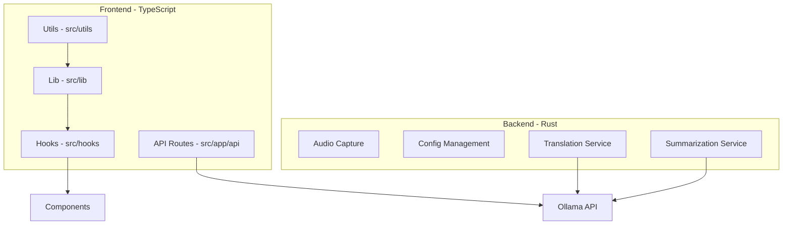

# Testing Implementation Plan

## Overview

This plan outlines a comprehensive unit testing strategy for SoulNotes using:
- **Vitest** for TypeScript/JavaScript (Next.js frontend, React hooks, utilities)
- **Rust built-in test framework** for Tauri backend

## Architecture Summary



---

## Part 1: Infrastructure Setup

### 1.1 Vitest Setup for TypeScript/JavaScript

**Dependencies to install:**
```bash
npm install -D vitest @vitest/coverage-v8 @testing-library/react @testing-library/jest-dom jsdom @types/node
```

**Configuration files needed:**

1. `vitest.config.ts` - Main Vitest configuration
2. `src/test/setup.ts` - Test setup file for DOM matchers and mocks
3. `src/test/mocks/` - Mock implementations directory

**vitest.config.ts structure:**
```typescript
import { defineConfig } from 'vitest/config'
import react from '@vitejs/plugin-react'
import path from 'path'

export default defineConfig({
  plugins: [react()],
  test: {
    environment: 'jsdom',
    setupFiles: ['./src/test/setup.ts'],
    coverage: {
      provider: 'v8',
      reporter: ['text', 'json', 'html'],
      exclude: ['node_modules/', 'src/test/'],
    },
  },
  resolve: {
    alias: {
      '@': path.resolve(__dirname, './src'),
    },
  },
})
```

**package.json scripts to add:**
```json
{
  "scripts": {
    "test": "vitest",
    "test:run": "vitest run",
    "test:coverage": "vitest run --coverage"
  }
}
```

### 1.2 Rust Test Setup

Rust has built-in testing - no additional dependencies needed. Tests will be:
- Unit tests in `#[cfg(test)]` modules within each source file
- Integration tests in `src-tauri/tests/` directory

**Cargo.toml additions for test dependencies:**
```toml
[dev-dependencies]
mockito = "1.5"  # HTTP mocking
tokio-test = "0.4"  # Async test utilities
tempfile = "3.10"  # Temporary file handling
```

---

## Part 2: TypeScript/JavaScript Test Plan

### 2.1 Utility Functions Tests

#### `src/utils/audio.ts`

| Function | Test Cases | Edge Cases |
|----------|-----------|------------|
| `floatTo16BitPCM` | Convert positive values correctly, Convert negative values correctly, Handle zero values | Clipping at -1.0 and 1.0 boundaries, Very small float values, Maximum/minimum Int16 range |
| `downsampleBuffer` | Same sample rate returns original, Downsample by factor of 2, Downsample non-integer ratio | Empty buffer, Single sample buffer, Very high sample rate ratio |
| `int16ToBase64` | Convert simple values, Handle multi-chunk data | Empty array, Maximum Int16 values, Data spanning multiple chunks |

**Test file:** `src/utils/__tests__/audio.test.ts`

```typescript
// Example test structure
describe('floatTo16BitPCM', () => {
  it('should convert positive float values to Int16 correctly', () => {
    const input = new Float32Array([0.5, 0.25, 0.0]);
    const result = floatTo16BitPCM(input);
    // Verify conversion
  });
  
  it('should clip values above 1.0 to Int16 max', () => {
    const input = new Float32Array([1.5, 2.0]);
    const result = floatTo16BitPCM(input);
    // Expect clipped values
  });
  
  // ... more tests
});
```

#### `src/utils/text.ts`

| Function | Test Cases | Edge Cases |
|----------|-----------|------------|
| `extractTranslatableChunk` | Extract on idle, Extract on interval elapsed, Respect max chunk length | Empty buffer, Whitespace-only buffer, Buffer exactly at max length, Unicode/multi-byte characters |
| `generateMessageId` | Generate unique IDs, Correct format | Multiple rapid calls for uniqueness |
| `formatTranscriptForSave` | Format single message, Format multiple messages with timestamps | Empty array, Messages with special characters, Very long text |
| `saveToFile` | Web mode download trigger, Desktop mode Tauri call | Empty content, Special filename characters |

**Test file:** `src/utils/__tests__/text.test.ts`

#### `src/utils/platform.ts`

| Function | Test Cases | Edge Cases |
|----------|-----------|------------|
| `isDesktopMode` | Returns true when __TAURI__ present, Returns false in browser | SSR environment, Undefined globalThis |
| `getInitialDarkMode` | Cookie dark theme, Cookie light theme, System preference fallback | No cookie, Invalid cookie value, SSR environment |

**Test file:** `src/utils/__tests__/platform.test.ts`

---

### 2.2 Library Module Tests

#### `src/lib/constants.ts`

| Test Area | Test Cases | Edge Cases |
|-----------|-----------|------------|
| Language constants | All languages have valid codes, No duplicate codes | Empty variants array |
| Default configs | All required fields present, Valid URL formats | Missing optional fields |
| Timing constants | Positive values, Reasonable ranges | Zero or negative values |

**Test file:** `src/lib/__tests__/constants.test.ts`

#### `src/lib/types.ts`

| Test Area | Test Cases | Edge Cases |
|-----------|-----------|------------|
| Interface compliance | Type guards if needed | Optional field handling |

**Note:** TypeScript interfaces are compile-time only. Tests should verify runtime behavior of implementations.

#### `src/lib/api.ts`

| Function/Service | Test Cases | Edge Cases |
|------------------|-----------|------------|
| `streamTextFromApi` | Successful stream, Error handling, Abort signal | Network error, Invalid JSON, Empty response, Timeout |
| `webTranslationService.translate` | Successful translation, Chunk callback handling | Empty text, API error, Stream interruption |
| `webSummarizationService.summarize` | Successful summarization | Empty text, API error |
| `webAudioDeviceService.getAudioDevices` | Returns devices, Handles permission denial | No devices, Permission denied |

**Test file:** `src/lib/__tests__/api.test.ts`

**Mocking strategy:**
- Mock `fetch` with controlled responses
- Mock `ReadableStream` for streaming tests
- Mock `navigator.mediaDevices` for audio device tests

#### `src/lib/platform.ts`

| Function | Test Cases | Edge Cases |
|----------|-----------|------------|
| `getPlatformAdapter` | Returns web adapter in browser, Returns Tauri adapter in desktop | Singleton instance caching |
| `getPlatform` | Returns consistent instance | Multiple calls return same instance |

**Test file:** `src/lib/__tests__/platform.test.ts`

**Mocking strategy:**
- Mock `isDesktopMode` to control adapter selection
- Mock Tauri and web service implementations

#### `src/lib/tauri.ts`

| Service | Test Cases | Edge Cases |
|---------|-----------|------------|
| `tauriTranslationService.translate` | Successful translation, Streaming chunks, Event listener cleanup | Tauri invoke error, Empty response, Missing onChunk callback |
| `tauriSummarizationService.summarize` | Successful summarization | Tauri invoke error, Empty text |
| `tauriAudioDeviceService.getAudioDevices` | Returns mapped devices, Handles error | Empty device list, Invoke failure |
| `saveFile` | Successful save, User cancellation | Dialog error, Write error |

**Test file:** `src/lib/__tests__/tauri.test.ts`

**Mocking strategy:**
- Mock `@tauri-apps/api/core` invoke function
- Mock `@tauri-apps/api/event` listen function
- Mock `@tauri-apps/plugin-dialog` and `@tauri-apps/plugin-fs`

---

### 2.3 React Hooks Tests

#### `src/hooks/useRealtimeTranscription.ts`

| Test Area | Test Cases | Edge Cases |
|-----------|-----------|------------|
| Initialization | Correct initial state | Default options |
| `startTranscription` | Sets up WebSocket, Requests media permissions, Creates audio context | Permission denied, WebSocket error, Audio context failure |
| `stopTranscription` | Closes WebSocket, Stops media tracks, Cleans up audio context | Already stopped, Null refs |
| `appendTranscript` | Final message handling, Streaming message handling | Empty text, Rapid consecutive calls |
| `parseRealtimeMessage` | Parse various message formats, Handle JSON parse errors | Malformed JSON, Unknown message types |
| WebSocket events | onmessage parsing, onerror handling, onopen resolution | Connection timeout, Unexpected close |

**Test file:** `src/hooks/__tests__/useRealtimeTranscription.test.ts`

**Mocking strategy:**
- Mock `navigator.mediaDevices.getUserMedia`
- Mock `WebSocket` class
- Mock `AudioContext` and related Web Audio API
- Mock utility functions from `@/utils/audio`

#### `src/hooks/useTranslation.ts`

| Test Area | Test Cases | Edge Cases |
|-----------|-----------|------------|
| Initialization | Correct initial state | Default options |
| `triggerTranslate` | Debouncing behavior, Language change reset, Delta text calculation | Empty text, Same text repeated, Rapid calls |
| Translation chunking | Max chunk length respected, Idle timeout triggers translation | Very long text, Text exactly at chunk boundary |
| Language change | Resets state on language change | Same language, Different source/target |
| `addTranslationMessage` | Final message, Streaming message updates | Empty text, Multiple streaming updates |

**Test file:** `src/hooks/__tests__/useTranslation.test.ts`

**Mocking strategy:**
- Mock `getPlatform()` to return mock translation service
- Mock `DEBOUNCE_DELAY` and `TRANSLATION_TIMING` constants
- Use `vi.useFakeTimers()` for debounce testing

#### `src/hooks/useSummarization.ts`

| Test Area | Test Cases | Edge Cases |
|-----------|-----------|------------|
| Initialization | Correct initial state | |
| `triggerSummarize` | Debouncing behavior, Skip same text, Empty text handling | Rapid calls, Text change during debounce |
| `summarize` | Successful summarization, Error handling | API error, Empty result |
| Cleanup | Clears timeout on unmount | Pending debounce on unmount |

**Test file:** `src/hooks/__tests__/useSummarization.test.ts`

**Mocking strategy:**
- Mock `getPlatform()` to return mock summarization service
- Use `vi.useFakeTimers()` for debounce testing

#### `src/hooks/useAudioDevices.ts`

| Test Area | Test Cases | Edge Cases |
|-----------|-----------|------------|
| Device enumeration | Lists input devices, Lists system devices | Permission denied, No devices |
| Device persistence | Saves settings, Loads settings | Save failure, Load failure |

**Test file:** `src/hooks/__tests__/useAudioDevices.test.ts`

---

### 2.4 API Route Tests

#### `src/app/api/translate/route.ts`

| Test Area | Test Cases | Edge Cases |
|-----------|-----------|------------|
| Request validation | Missing text returns 400 | Empty text, Whitespace only |
| Config loading | Loads from primary path, Falls back to secondary, Uses defaults | Invalid YAML, Missing file, Permission error |
| Language resolution | Known language codes, Unknown codes fallback | Missing language parameter |
| Prompt template | Variable substitution, Custom prompt from config | Missing variables, Malformed template |
| Ollama integration | Successful streaming response, Error handling | Connection failure, Timeout, Invalid model |
| Authentication | Token from env, Token from config | Missing token, Invalid token |

**Test file:** `src/app/api/translate/__tests__/route.test.ts`

**Mocking strategy:**
- Mock `fs` module for config loading
- Mock `Ollama` class
- Mock `process.env`

#### `src/app/api/summarize/route.ts`

| Test Area | Test Cases | Edge Cases |
|-----------|-----------|------------|
| Request validation | Missing text returns 400 | Empty text |
| Config loading | Same as translate route | |
| Prompt template | Variable substitution | |
| Ollama integration | Successful response, Error handling | Connection failure |

**Test file:** `src/app/api/summarize/__tests__/route.test.ts`

---

## Part 3: Rust Test Plan

### 3.1 Audio Processing Tests

**Test module:** `src-tauri/src/lib.rs` - `#[cfg(test)] mod tests`

| Function | Test Cases | Edge Cases |
|----------|-----------|------------|
| `AudioChunk` serialization | Serialize/deserialize correctly | Empty data, Large data |
| `AppConfig` serialization | All fields serialize, Optional fields | Missing fields, Invalid YAML |

**Note:** Audio stream functions require hardware and cannot be easily unit tested. Integration tests would be needed for `start_audio_capture`, `stop_audio_capture`, etc.

### 3.2 Config Management Tests

| Function | Test Cases | Edge Cases |
|----------|-----------|------------|
| `load_config` | Load valid YAML, Handle missing file, Handle invalid YAML | Empty file, Permission denied, Invalid UTF-8 |
| `save_config` | Save valid config, Create parent directories | Invalid path, Permission denied |
| `get_default_config` | Returns all expected defaults | |

**Test file:** `src-tauri/src/config.rs` (extract config logic to separate module for testability)

```rust
#[cfg(test)]
mod tests {
    use super::*;
    use tempfile::tempdir;

    #[test]
    fn test_load_config_missing_file() {
        let dir = tempdir().unwrap();
        let path = dir.path().join("nonexistent.yml");
        // Test loading from non-existent path
    }

    #[test]
    fn test_load_config_valid_yaml() {
        let dir = tempdir().unwrap();
        let path = dir.path().join("config.yml");
        // Write valid YAML and test loading
    }

    #[test]
    fn test_load_config_invalid_yaml() {
        let dir = tempdir().unwrap();
        let path = dir.path().join("config.yml");
        // Write invalid YAML and test error handling
    }

    #[test]
    fn test_save_config_creates_directory() {
        let dir = tempdir().unwrap();
        let path = dir.path().join("subdir/config.yml");
        // Test that parent directory is created
    }
}
```

### 3.3 Language Label Tests

| Function | Test Cases | Edge Cases |
|----------|-----------|------------|
| Language label lookup | All supported languages, Fallback for unknown | Empty string, Unknown code |

```rust
#[test]
fn test_language_labels() {
    let labels = [
        ("en", "English"),
        ("zh", "Chinese"),
        ("zh-simplified", "Simplified Chinese"),
        // ... test all labels
    ];
    
    for (code, expected) in labels {
        // Verify lookup
    }
}

#[test]
fn test_unknown_language_fallback() {
    // Unknown code should return the code itself
}
```

### 3.4 Prompt Template Tests

| Function | Test Cases | Edge Cases |
|----------|-----------|------------|
| Prompt variable substitution | All placeholders replaced, Multiple occurrences | Missing placeholder, Extra text preserved |

```rust
#[test]
fn test_translate_prompt_substitution() {
    let template = "Translate from {source_language} to {target_language}: {text}";
    // Test substitution
}

#[test]
fn test_summarize_prompt_substitution() {
    let template = "Summarize: {text}";
    // Test substitution
}
```

### 3.5 HTTP Client Tests (with mocking)

| Function | Test Cases | Edge Cases |
|----------|-----------|------------|
| `translate_text` | Successful translation, Streaming chunks, Error response | Network error, Timeout, Invalid JSON response |
| `summarize_text` | Successful summarization, Error response | Network error, Empty response |

**Note:** These require mocking `reqwest`. Use `mockito` for HTTP mocking.

```rust
#[cfg(test)]
mod tests {
    use mockito::Server;
    
    #[tokio::test]
    async fn test_translate_text_success() {
        let mut server = Server::new();
        // Mock Ollama API response
    }

    #[tokio::test]
    async fn test_translate_text_streaming() {
        // Test streaming response parsing
    }
}
```

---

## Part 4: Test File Structure

```
src/
├── test/
│   ├── setup.ts                    # Global test setup
│   ├── mocks/
│   │   ├── tauri.ts               # Tauri API mocks
│   │   ├── fetch.ts               # Fetch API mocks
│   │   ├── webSocket.ts           # WebSocket mocks
│   │   ├── audioContext.ts        # Web Audio API mocks
│   │   └── mediaDevices.ts        # Media devices mocks
│   └── utils/
│       └── testHelpers.ts         # Shared test utilities
├── utils/
│   └── __tests__/
│       ├── audio.test.ts
│       ├── text.test.ts
│       └── platform.test.ts
├── lib/
│   └── __tests__/
│       ├── constants.test.ts
│       ├── api.test.ts
│       ├── platform.test.ts
│       └── tauri.test.ts
├── hooks/
│   └── __tests__/
│       ├── useRealtimeTranscription.test.ts
│       ├── useTranslation.test.ts
│       ├── useSummarization.test.ts
│       └── useAudioDevices.test.ts
└── app/
    └── api/
        ├── translate/
        │   └── __tests__/
        │       └── route.test.ts
        └── summarize/
            └── __tests__/
                └── route.test.ts

src-tauri/
├── src/
│   ├── lib.rs                      # Contains #[cfg(test)] mod tests
│   └── config.rs                   # Extracted config module with tests
└── tests/                          # Integration tests
    ├── config_integration_test.rs
    └── audio_integration_test.rs
```

---

## Part 5: Coverage Targets

### TypeScript/JavaScript Coverage Goals

| Category | Target | Priority |
|----------|--------|----------|
| Utility functions | 100% | High |
| Library modules | 90%+ | High |
| React hooks | 85%+ | Medium |
| API routes | 80%+ | Medium |

### Rust Coverage Goals

| Category | Target | Priority |
|----------|--------|----------|
| Config management | 100% | High |
| Data structures | 100% | High |
| HTTP client logic | 90%+ | Medium |
| Audio capture | N/A | Integration tests |

---

## Part 6: Implementation Order

### Phase 1: Infrastructure Setup
1. Install Vitest and dependencies
2. Create `vitest.config.ts`
3. Create test setup file with DOM matchers
4. Create mock implementations directory
5. Add Rust dev dependencies to `Cargo.toml`

### Phase 2: Pure Function Tests (Highest ROI)
1. `src/utils/audio.ts` tests
2. `src/utils/text.ts` tests
3. `src/utils/platform.ts` tests
4. `src/lib/constants.ts` tests
5. Rust config management tests

### Phase 3: Service Layer Tests
1. `src/lib/api.ts` tests
2. `src/lib/tauri.ts` tests
3. `src/lib/platform.ts` tests
4. Rust HTTP client tests (with mocking)

### Phase 4: React Hook Tests
1. `useSummarization` tests (simplest)
2. `useTranslation` tests
3. `useRealtimeTranscription` tests (most complex)
4. `useAudioDevices` tests

### Phase 5: API Route Tests
1. `/api/translate` tests
2. `/api/summarize` tests

---

## Part 7: Mock Implementations Reference

### WebSocket Mock
```typescript
// src/test/mocks/webSocket.ts
export class MockWebSocket {
  static CONNECTING = 0;
  static OPEN = 1;
  static CLOSING = 2;
  static CLOSED = 3;

  readyState = MockWebSocket.OPEN;
  onopen: ((event: Event) => void) | null = null;
  onmessage: ((event: MessageEvent) => void) | null = null;
  onerror: ((event: Event) => void) | null = null;
  onclose: ((event: CloseEvent) => void) | null = null;

  constructor(public url: string) {}
  send(data: string) {}
  close() { this.readyState = MockWebSocket.CLOSED; }
}
```

### Tauri API Mock
```typescript
// src/test/mocks/tauri.ts
export const mockInvoke = vi.fn();
export const mockListen = vi.fn();

vi.mock('@tauri-apps/api/core', () => ({
  invoke: mockInvoke,
}));

vi.mock('@tauri-apps/api/event', () => ({
  listen: mockListen,
}));
```

### Fetch Mock
```typescript
// src/test/mocks/fetch.ts
export function createMockResponse(data: string, options: ResponseInit = {}) {
  return new Response(data, options);
}

export function createMockStream(chunks: string[]) {
  const encoder = new TextEncoder();
  return new ReadableStream({
    async start(controller) {
      for (const chunk of chunks) {
        controller.enqueue(encoder.encode(chunk));
      }
      controller.close();
    }
  });
}
```

---

## Summary

This testing plan provides comprehensive unit test coverage for:

- **TypeScript/JavaScript**: 4 utility modules, 4 library modules, 4 React hooks, 2 API routes
- **Rust**: Config management, data structures, HTTP client logic

Total estimated test files: **15 TypeScript test files + 3-4 Rust test modules**

The focus on pure functions and mocked dependencies ensures:
- Fast test execution
- Reliable, deterministic tests
- High code coverage
- Easy maintenance