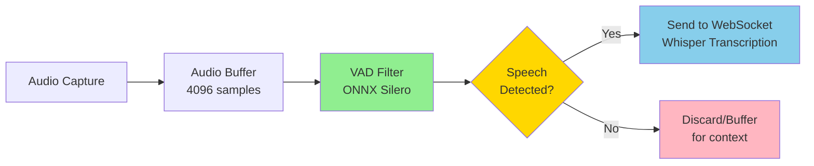
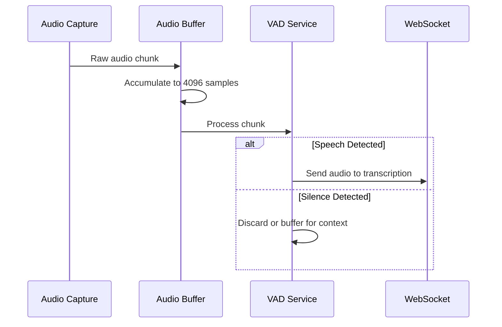

# VAD Integration Plan - Preventing Transcription Hallucinations

## Problem Statement

The transcription system generates hallucinated text during silence/noise periods. This happens because:
1. Audio is continuously sent to Whisper regardless of speech presence
2. Whisper attempts to transcribe silence/noise, producing hallucinations
3. No pre-filtering exists to detect actual speech vs. silence

## Solution: Client-Side VAD with Silero ONNX

### Why Client-Side VAD?

| Approach | Pros | Cons |
|----------|------|------|
| **Server-side HTTP VAD** | Uses existing Speaches server | Not realtime, high latency, complex buffering |
| **Client-side ONNX VAD** | True realtime, no network latency, works offline | ~2-5MB model download, ONNX runtime dependency |
| **Combined Realtime API** | Already integrated | Appears to NOT have VAD filtering (hallucinations occur) |

**Recommendation: Client-side ONNX VAD** - Best for realtime filtering with minimal latency impact.

## Architecture Overview



## Implementation Plan

### Phase 1: VAD Service Layer

Create a new VAD service that wraps the Silero ONNX model:

**File: `src/lib/vad-service.ts`**

```typescript
// Key responsibilities:
// 1. Load and manage Silero VAD ONNX model
// 2. Process audio chunks for speech detection
// 3. Maintain VAD state (speech segments, buffering)
// 4. Provide callbacks for speech start/end events
```

**Key interfaces:**
```typescript
interface VADConfig {
  modelPath: string;           // Path to silero_vad.onnx
  threshold: number;           // Speech threshold (0.5 default)
  minSpeechDurationMs: number; // Min speech duration to trigger (250ms)
  minSilenceDurationMs: number; // Min silence to end speech (100ms)
  sampleRate: number;          // Must be 8000 or 16000 (will resample)
}

interface VADResult {
  isSpeech: boolean;
  confidence: number;
  speechStart?: boolean;  // True at speech onset
  speechEnd?: boolean;    // True at speech offset
}
```

### Phase 2: VAD Hook

Create a React hook for VAD integration:

**File: `src/hooks/useVAD.ts`**

```typescript
// Key responsibilities:
// 1. Manage VAD service lifecycle
// 2. Process audio chunks from capture
// 3. Buffer audio during speech segments
// 4. Forward speech audio to transcription
```

### Phase 3: Integration Point

Modify the audio flow in `useRealtimeTranscription.ts`:

**Current flow:**
```
Audio Capture → Buffer (4096) → sendAudioData → WebSocket
```

**New flow:**
```
Audio Capture → Buffer (4096) → VAD Filter → sendAudioData → WebSocket
```

## Detailed Component Design

### 1. VAD Service (`src/lib/vad-service.ts`)

```typescript
export class VadService {
  private model: InferenceSession | null = null;
  private state: Float32Array;  // Hidden state for recurrent model
  private context: Float32Array; // Context for model
  
  async initialize(config: VADConfig): Promise<void>;
  processChunk(pcm16: Int16Array): VADResult;
  reset(): void;
  dispose(): void;
}
```

**Key implementation details:**
- Silero VAD requires 512, 768, or 1024 sample frames (at 16kHz)
- Audio at 24kHz must be downsampled to 16kHz for VAD
- Model maintains hidden state for continuous processing
- Reset state on speech end for clean segments

### 2. VAD Hook (`src/hooks/useVAD.ts`)

```typescript
export function useVAD(options: UseVADOptions): UseVADReturn {
  // State
  const [isSpeech, setIsSpeech] = useState(false);
  const [isInitialized, setIsInitialized] = useState(false);
  
  // Refs
  const vadServiceRef = useRef<VadService | null>(null);
  const audioBufferRef = useRef<Int16Array[]>([]);
  const speechSegmentRef = useRef<Int16Array[]>([]);
  
  // Methods
  const initialize = useCallback(async () => { ... });
  const processAudio = useCallback((pcm16: Int16Array) => { ... });
  const reset = useCallback(() => { ... });
  
  return { isSpeech, isInitialized, processAudio, reset };
}
```

### 3. Modified Audio Pipeline

**In `useRealtimeTranscription.ts`:**

```typescript
// Add VAD option to hook parameters
interface UseRealtimeTranscriptionOptions {
  // ... existing options
  useVAD?: boolean;
  vadConfig?: Partial<VADConfig>;
}

// In sendAudioData, add VAD filtering
const sendAudioData = useCallback((pcm16: Int16Array) => {
  if (useVAD && vadService.current) {
    const vadResult = vadService.current.processChunk(pcm16);
    
    if (!vadResult.isSpeech) {
      // Don't send silence to transcription
      return;
    }
  }
  
  // Existing send logic
  wsRef.current.send(JSON.stringify({ type: 'input_audio_buffer.append', audio: base64 }));
}, [useVAD]);
```

### 4. Configuration Updates

**In `src/lib/constants.ts`:**

```typescript
export const VAD_CONFIG = {
  modelPath: '/models/silero_vad.onnx',
  threshold: 0.5,
  minSpeechDurationMs: 250,
  minSilenceDurationMs: 100,
  sampleRate: 16000,  // VAD requires 8kHz or 16kHz
} as const;
```

## Audio Processing Flow



## Silero VAD Model Details

- **Model:** silero_vad.onnx (~2MB)
- **Input:** 512/768/1024 samples at 16kHz (32/48/64ms frames)
- **Output:** Speech probability (0.0-1.0)
- **Stateful:** Maintains hidden state across frames
- **Sample Rate:** Must be 8000 or 16000 Hz

**Resampling requirement:**
- Current audio: 24kHz
- VAD requires: 16kHz
- Need to downsample 24kHz → 16kHz before VAD

## File Changes Summary

| File | Change |
|------|--------|
| `src/lib/vad-service.ts` | **NEW** - VAD service class |
| `src/hooks/useVAD.ts` | **NEW** - VAD React hook |
| `src/hooks/useRealtimeTranscription.ts` | **MODIFY** - Add VAD filtering |
| `src/lib/constants.ts` | **MODIFY** - Add VAD config |
| `public/models/silero_vad.onnx` | **NEW** - Silero VAD model file |
| `package.json` | **MODIFY** - Add onnxruntime-web dependency |

## Dependencies

```json
{
  "dependencies": {
    "onnxruntime-web": "^1.17.0"
  }
}
```

## Testing Strategy

1. **Unit tests for VAD service:**
   - Test initialization
   - Test speech detection with known audio samples
   - Test state management

2. **Integration tests:**
   - Test audio pipeline with VAD enabled/disabled
   - Compare transcription results with/without VAD

3. **Manual testing:**
   - Verify no hallucinations during silence
   - Verify speech is captured correctly
   - Test with various noise levels

## Risks and Mitigations

| Risk | Mitigation |
|------|------------|
| ONNX model download size | Load model lazily, show loading indicator |
| VAD false negatives (missed speech) | Lower threshold, add pre-buffer |
| VAD false positives (noise as speech) | Increase threshold, add noise filtering |
| Latency from resampling | Use efficient resampling algorithm |
| Memory leaks from ONNX | Proper cleanup in useEffect |

## Alternative: Server-Side VAD (Future Consideration)

If client-side VAD proves problematic, consider:

1. **Batched HTTP VAD:** Accumulate 1-2 seconds of audio, send to `/v1/audio/speech/timestamps`, extract speech segments, send to WebSocket
2. **WebSocket VAD endpoint:** If Speaches adds a WebSocket VAD endpoint in the future

## Implementation Order

1. [ ] Add onnxruntime-web dependency
2. [ ] Download and add silero_vad.onnx model
3. [ ] Create `VadService` class
4. [ ] Create `useVAD` hook
5. [ ] Integrate into `useRealtimeTranscription`
6. [ ] Add configuration options
7. [ ] Add tests
8. [ ] Manual testing and validation

## Questions for User

1. Should VAD be enabled by default or opt-in?
2. Should we show a UI indicator when VAD is filtering silence?
3. Do you want configurable VAD threshold in settings?